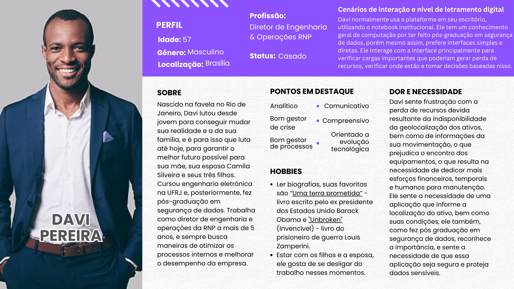
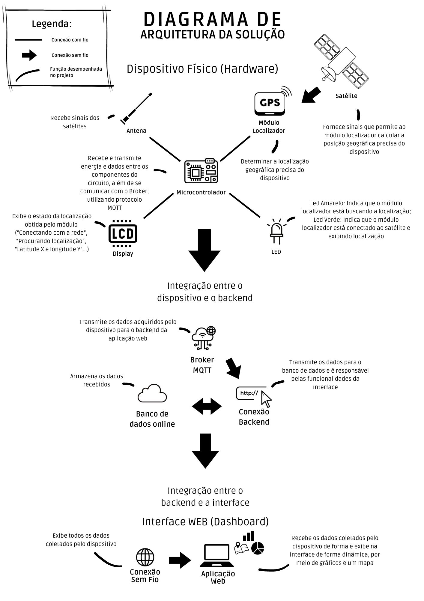
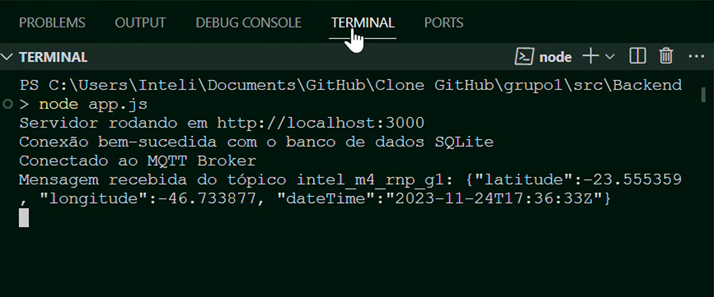

# Documentação IoTDoc - Módulo 4 - Inteli

## Wi-Connect

#### <a href="https://www.linkedin.com/school/inteli-edu/">Daniel Augusto Rivas Mendez</a>, <a href="https://www.linkedin.com/in/eduarda-cardoso-de-souza-8bb802268/">Eduarda Cardoso de Souza</a>, <a href="https://www.linkedin.com/in/gabriellediascartaxo/">Gabrielle Dias Cartaxo</a>, <a href="https://www.linkedin.com/in/heloisa-cavalcanti-oliveira/">Heloisa Cavalcanti Oliveira</a>, <a href="https://www.linkedin.com/in/izadoraluz-rsn/">Izadora Luz Rodrigues Novaes</a>, <a href="https://www.linkedin.com/in/luizarsantana/">Luiza Rodrigues Santana</a> e <a href="https://www.linkedin.com/in/thomasreitzfeld/">Thomas Reitzfeld</a>

## Sumário

[1. Introdução](#c1)

[2. Metodologia](#c2)

[3. Desenvolvimento e Resultados](#c3)

[4. Possibilidades de Descarte](#c4)

[5. Conclusões e Recomendações](#c5)

[6. Referências](#c6)

 

# 1. Introdução 

&emsp;A RNP (Rede Nacional de Ensino e Pesquisa) é uma organização brasileira de grande porte, localizada em todo o território nacional, que atua na área de tecnologia da informação e comunicação voltada para o meio acadêmico e de pesquisa. A RNP fornece infraestrutura de comunicação avançada para instituições de ensino e pesquisa no Brasil. Seu foco principal é no fornecimento de conectividade e serviços de rede para instituições de ensino superior e pesquisa, desempenhando um papel fundamental no suporte à inovação e ao avanço acadêmico no país.  
&emsp;O problema a ser resolvido está relacionado a desafios específicos de localização de ferramentas que a RNP possui (nesse documento, vamos nos referir tais ferramentas como "ativos"), sendo eles na precisão do detalhamento, na gestão de vínculos, no controle e visibilidade dos ativos da empresa, resultando em uma série de questões, como perda de ativos, desperdício de recursos, aumento dos custos de manutenção e substituição, bem como obstáculos no planejamento do estoque estratégico.

## 1.1 Objetivos

&emsp;Os objetivos gerais de um projeto são as metas amplas e conceituais, enquanto os objetivos específicos são as metas detalhadas e mensuráveis que contribuem para a realização dos objetivos gerais.

&emsp;Os nossos objetivos gerais são: 
Desenvolver um protótipo para a localização eficiente de ativos da RNP distribuídos em todo o Brasil, garantindo facilidade na identificação e fornecendo informações atualizadas e precisas sobre a localização de cada ativo. Além disso, o protótipo permitirá a realização de consultas e a geração de relatórios abrangentes sobre o status e histórico de movimentação dos ativos.

&emsp;Enquanto os objetivos específicos são: 
1. Projetar e desenvolver uma interface de usuário amigável que permita a visualização de ativos distribuídos pela RNP em todo o Brasil.
2. Estabelecer um banco de dados centralizado para armazenar informações detalhadas de cada ativo, incluindo coordenadas de localização geográfica, datas de registro e proprietários responsáveis.
3. Implementar tecnologias de rastreamento, como GPS, para garantir informações de localização atualizadas.
4. Desenvolver um filtro de consulta na interface que permita aos usuários buscar ativos com base em critérios específicos, como localização geográfica, tipo de ativo e status.
5. Realizar testes de usabilidade e desempenho do protótipo, coletando feedback.

## 1.2 Proposta da solução

&emsp;A proposta de solução para o problema de localização e gestão de ativos da RNP envolve o desenvolvimento de um sistema de localização, utilizando chips ESP32. Este sistema contará com uma interface de usuário fácil de usar, simples e um banco de dados centralizado para armazenar os dados dos ativos. Os chips ESP32 serão incorporados aos ativos e enviarão informações de localização em tempo real via GPS para o banco de dados, em um intervalo definido.

&emsp;A interface permitirá que os usuários visualizem a localização de todos os ativos em um mapa, bem como filtrar os resultados com base em critérios como tipo de ativo, localização geográfica e status. Além disso, o sistema será capaz de gerar relatórios sobre o histórico de movimentação e status dos ativos, auxiliando na tomada de decisões e na gestão estratégica.

&emsp;Ao combinar rastreamento em tempo real, armazenamento centralizado de dados e uma interface, esta solução visa atingir os objetivos específicos e gerais do projeto, otimizando a localização e a gestão de ativos da RNP, de uma forma automática.

## 1.3 Justificativa

&emsp;A solução proposta oferece vários benefícios que a destacam como uma opção viável e eficiente para a RNP. Primeiramente, a utilização do chip ESP32, uma tecnologia acessível e confiável, permite um rastreamento eficaz em tempo real, o que é crucial para a localização precisa dos ativos.

&emsp;O banco de dados centralizado garante que as informações estejam sempre atualizadas e acessíveis, minimizando o risco de perda ou uso inadequado dos ativos. A interface de usuário amigável torna o sistema acessível para pessoas com diferentes níveis de familiaridade com a tecnologia, ampliando sua usabilidade.

&emsp;Além disso, a capacidade de gerar relatórios abrangentes oferece uma ferramenta valiosa para o planejamento e a tomada de decisões estratégicas, contribuindo para a redução de custos e o aumento da eficiência operacional.

&emsp;Portanto, a solução proposta não apenas atende aos objetivos específicos e gerais do projeto, mas também oferece uma abordagem inovadora e eficiente para a gestão de ativos da RNP.

# 2. Metodologia 

&emsp;O RM-ODP, que significa "Reference Model for Open Distributed Processing", é um padrão de referência para sistemas de processamento distribuído aberto. Foi desenvolvido conjuntamente pela Organização Internacional para Padronização (ISO) e pela União Internacional de Telecomunicações (ITU). O objetivo principal do RM-ODP é estabelecer um framework comum para a descrição de sistemas distribuídos.

&emsp;As cinco visões arquiteturais do RM-ODP são fundamentais para entender como ele aborda o design e a especificação de sistemas distribuídos. Cada visão oferece uma perspectiva diferente, focando em aspectos específicos do sistema. Lembrando que elas são complementares, ou seja, apesar de cada uma possuir a sua especifidade, para contruir uma arquitetura de software ideal elas precisam estar interligadas. Vamos explorar cada uma delas:

&emsp;Visão de Negócios:

- Foca nos aspectos organizacionais do sistema.
- Trata das metas, objetivos e políticas do sistema.
- Define o contexto no qual o sistema opera, incluindo as funções e responsabilidades de cada entidade envolvida.
- Essencial para compreender as motivações por trás da construção do sistema e como ele se alinha aos objetivos do negócio.
  
&emsp;Escrevendo de forma objetiva, a visão empresarial busca evidenciar o problema apontando as demandas do negócio;

&emsp;Visão de Requisitos Funcionais:

- São geralmente mais fáceis de medir e validar.
- São especificados em termos de ações do sistema ou fluxos de trabalho.
- Têm um impacto direto na experiência do usuário com as funcionalidades do software.
  
&emsp;Requisitos funcionais descrevem o que o sistema deve fazer, ou seja, as funções específicas ou comportamentos do sistema. Eles estão diretamente relacionados às tarefas e funções que o software precisa executar.

&emsp;Visão de Requisitos não Funcionais:

- Frequentemente mais desafiadores para medir e validar.
- São geralmente expressos como padrões, convenções ou restrições sobre o design do sistema.
- Impactam a qualidade global do sistema e a satisfação do usuário, mas não são funcionalidades diretas do software.
  
&emsp;Requisitos não funcionais, por outro lado, descrevem como o sistema deve ser ou como ele deve operar. Eles estão relacionados a qualidades do sistema, como desempenho, segurança e usabilidade. Para uma padronização, a ISO lançou o ISO-25010. Esta norma é amplamente utilizada no desenvolvimento de software para orientar a qualidade do produto final. Ela ajuda as organizações a avaliar os produtos de software de forma consistente e completa, considerando uma variedade de perspectivas que são importantes para diferentes stakeholders.

&emsp;Visão de Arquitetura:

- Aborda os aspectos relacionados à infraestrutura necessária para suportar as interações do sistema.
- Essencial para o design detalhado dos componentes do sistema e sua interconexão.
- Agnóstica a Tecnologia
  
&emsp;É um modelo do sistema que transmite a mensagem sem as especifidades técnincas. Onde é apresentado parte de tolerância a falhas; EX: disponiblidade e acessibilidade. Podemos pensar que ela é utilizada para explicar a arquitetura a um executivo (como funciona, a sua lógica, em quais cenários será aplicada e etc) sem constatar a parte técnica.

&emsp;Visão de Tecnologia:

- Relaciona-se com as tecnologias concretas e as escolhas de hardware e software.
- Trata da seleção de plataformas tecnológicas e ferramentas específicas.
- Auxilia na decisão sobre as tecnologias específicas a serem utilizadas na construção do sistema.

&emsp;Se por um lado a visão de arquitetura não aborda o quesito técnico, aqui passa a mensagem técnica sobre o modelo e suas especifidades. É onde o programador estaria interessado em olhar para compreender o porquê da implementação da tecnologia X e não Y; O porquê de ter utilizado a linguagem C++ e não Python.

# 3. Desenvolvimento e Resultados 
&emsp;Na seção de "Desenvolvimento e Resultados", a equipe da Wi-Connect descreve minuciosamente o processo de pesquisa realizado, bem como apresenta os principais resultados obtidos. Nessa seção, os autores explicam em detalhes como o projeto foi conduzido, descrevem os métodos e abordagens empregados e apresentam as descobertas e conclusões alcançadas.

&emsp;Primeiramente, no contexto da Análise de Mercado (tópico 3.1 e seus respectivos subtópicos), é realizada uma análise aprofundada da RNP. Ferramentas e frameworks relevantes, como SWOT, as 5 Forças de Porter e o Value Proposition Canvas, entre outros, são utilizados para definir o posicionamento da RNP no mercado e analisar suas forças e desafios, com o objetivo de entregar a melhor solução possível.

&emsp;No tópico 3.2 e seus respectivos subtópicos, com base nas informações coletadas durante a Análise de Mercado, o Domínio de Fundamentos de Experiência do Usuário é desenvolvido. Esse domínio tem como propósito compreender com precisão para quem a solução está sendo criada, investigar as dores e necessidades específicas desse público-alvo e, assim, entender seus comportamentos e como a solução pode atender a essas necessidades.

&emsp;Em seguida temos os resultados (tópico 3.4) no qual abordamos os pontos que são atingidos dentro do nosso projeto. Os propósitos principais de nosso projeto são: localizar o ativo e ajudar no controle de estoque. Isso é feito através do nosso dispositivo IoT que manda os dados para o nosso banco de dados e os exibe no nosso site.

&emsp;Posteriormente, no tópico 3.4, são apresentados os resultados alcançados dentro do escopo do nosso projeto. Os objetivos centrais incluem a localização do ativo e aprimoramento do controle de estoque. Essas metas são alcançadas por meio do nosso dispositivo IoT, responsável por transmitir dados para o banco de dados central, os quais são exibidos em nosso site.

&emsp;Em resumo, esta seção contém os detalhes essenciais da pesquisa e as informações críticas que validam a solução. Essas informações formam a base para a compreensão e interpretação dos resultados do projeto, permitindo avaliar sua relevância e contribuição tanto no âmbito acadêmico quanto no mercado em que a Wi-Connect atua.

## 3.1. Domínio de Fundamentos de Negócio

&emsp;A análise de negócios é um componente crítico e fundamental em qualquer projeto, independente de seu tamanho ou complexidade. Ela desempenha um papel crucial na definição dos objetivos, no alinhamento dos processos de negócios e na identificação das necessidades dos stakeholders. Em suma, tem importância fundamental no momento de criar uma solução que se adeque as necessidades da empresa. Segue a análise de negócios feita pelo grupo Wi-Connect para a RNP.

### 3.1.1. Contexto da Indústria 
&emsp;O setor de telecomunicações é responsável pela comunicação e transmissão de dados de um país, sendo evidente a sua relevância em um mundo globalizado. Ele é composto por empresas ou organizações que tornam possível a comunicação em escala global, seja através do telefone ou por meio da internet, em conexões por cabo ou sem fio. As empresas que atuam nesse setor são responsáveis por construir e operar toda a infraestrutura necessária para a transmissão de dados entre as diversas regiões do país e do mundo.

&emsp;Dentro deste contexto, a indústria de redes de ensino e pesquisa é crucial para o desenvolvimento científico e tecnológico de um país. Em muitos países, essas redes são espinhas dorsais que conectam universidades, institutos de pesquisa, hospitais e outras organizações, permitindo colaboração, troca de dados em grande escala e acesso a recursos computacionais avançados.

&emsp;É justamente nesses setores que a RNP atua, como uma rede acadêmica brasileira, proporcionando infraestrutura avançada de Internet para a comunidade de pesquisa e educação no Brasil. Além disso, também está conectada com demais redes de educação e pesquisa na América Latina, América do Norte, África, Europa, Ásia e Oceania por meio de cabos de fibra óptica terrestres e submarinas. A Rede Nacional de Ensino e Pesquisa (RNP) não é uma empresa no sentido convencional, mas sim uma organização social qualificada pelo Ministério da Ciência, Tecnologia, Inovações (MCTI) e mantida por esse, em conjunto com os ministérios de Educação (MEC), das Comunicações (MCom), Cultura, Saúde (MS) e Defesa (MD) que participam do programa Interministerial RNP (PRO-RNP).

#### Setor
&emsp;Tecnologia da informação e comunicação, com foco específico em redes e infraestrutura de TI para a comunidade acadêmica, científica e de pesquisa do Brasil.

#### Competidores
&emsp;O mercado e o contexto em que a RNP opera no Brasil não são tão desenvolvidos e amplos como em outros países mais tecnologicamente avançados. Dito isso, a competitividade no mercado de IoT e gestão de ativos para a educação e pesquisa no Brasil não é acirrada; porém, isso não significa que não haja competidores. A RNP possui um diferencial considerável devido à sua extensa rede e histórico pioneiro nesse setor. Entretanto, ainda existem competidores em setores similares que podem atrair possíveis clientes, incluindo empresas de telecomunicações como Oi, Vivo e Claro, que oferecem serviços de conectividade de alta velocidade, embora não sejam especializadas em ambientes de educação e pesquisa. Além dessas empresas nacionais, vale mencionar a Space X com seu novo produto 'Starlink', que está levando a internet para os lugares mais remotos do mundo por meio de um dispositivo que se conecta à internet via satélites, sem o uso de cabos coaxiais ou de fibra óptica.

&emsp;Após conversar com a equipe da RNP e realizar pesquisas internas, chegamos a um consenso de que não existe concorrência direta no mercado de atuação da RNP. Não há outra instituição que ofereça a mesma variedade de serviços e produtos que a RNP oferece. Claro, se analisarmos cada serviço separadamente, encontraremos diversos concorrentes, como Vivo, Vital, EletroSul e outros. No entanto, quando consideramos o mercado-alvo da RNP e o fato de que seu principal cliente é o Governo, torna-se inevitável a busca por uma única empresa que ofereça uma ampla gama de serviços. Isso ocorre por diversos motivos, sendo os principais o fator financeiro (é mais econômico contratar uma única organização para vários serviços) e a comunicação (quando uma única empresa presta os serviços, a comunicação se torna mais fácil, tanto para alinhar expectativas quanto para esclarecer dúvidas). É importante observar que algumas empresas que poderiam ser consideradas concorrentes são, na verdade, parceiras ou clientes da RNP, como é o caso da Fapesp.

#### Modelo de Negócio
&emsp;A RNP é uma empresa única no cenário brasileiro, sendo a pioneira na implementação de uma rede de internet no país. Ela opera como uma organização social, vinculada a vários ministérios do Brasil, e tem como principal missão fornecer serviços robustos e personalizados para instituições de ensino, pesquisa e órgãos governamentais. Atualmente, a RNP beneficia mais de 4 milhões de alunos, professores e pesquisadores brasileiros, diferenciando-se das empresas privadas por sua missão social e acadêmica claramente definida.

&emsp;O modelo de negócios da RNP se baseia em fornecer conectividade e serviços avançados de TI para instituições de ensino superior, unidades de pesquisa e hospitais universitários. Financiada pelo governo brasileiro, a RNP garante o acesso dessas instituições a uma rede de alta capacidade, serviços de nuvem, segurança e outros recursos. Além da infraestrutura de rede, a RNP também se destaca por desenvolver projetos colaborativos e inovadores em áreas como telemedicina, teleducação e cultura digital. A organização desempenha um papel importante na capacitação e formação de profissionais em Tecnologias da Informação e Comunicação (TICs).

&emsp;O Governo Brasileiro é o principal cliente e financiador da RNP, delimitando sua área de atuação e orçamento para cada projeto. No entanto, a organização também começa a explorar oportunidades no mercado privado, demonstrando uma abertura para expandir suas atividades e explorar novas tendências.

#### Tendências
&emsp;No mercado brasileiro, este mercado está caminhando para expandir a conectividade aos ambientes acadêmicos e de pesquisa, o que está em linha com a missão e os objetivos da RNP. Está sendo feito muito trabalho para estender essas redes para alcançar regiões remotas e menos favorecidas do país. Este é um aspecto fundamental para democratizar o acesso a informações e recursos educacionais. Neste cenário, a RNP tem a oportunidade de usar sua posição única e seus relacionamentos para se tornar uma referência em soluções de conectividade e gestão de ativos no país. Com esses projetos, a organização não só atende a uma demanda em crescimento mas também reforça seu papel como um facilitador crucial para o avanço acadêmico e científico no país.

&emsp;Além disso, a expansão das redes da RNP é uma prioridade, com a crescente demanda por conectividade e a necessidade de digitalização em diversas áreas. Espera-se que a infraestrutura da RNP continue a expandir, alcançando mais instituições e regiões do Brasil. A organização também está investindo em soluções de segurança, dada a crescente ameaça de ataques cibernéticos, com o programa "Hackers do Bem" como um exemplo de sua atuação nesse campo.

&emsp;A RNP está acompanhando a demanda por serviços de computação em nuvem, armazenamento de dados e soluções avançadas de videoconferência, o que pode levar à expansão de sua oferta nesse sentido. Além disso, a automação de processos internos, como a verificação da localização e quantidade de maquinários, é uma área em que a organização está explorando a tecnologia para melhorar a eficiência. Portanto, a RNP está se preparando para enfrentar os desafios tecnológicos e de conectividade do futuro, enquanto fortalece seu papel no avanço acadêmico e científico no país.

### Análise 5 Forças de Porter
&emsp;As 5 Forças de Porter são um framework de análise setorial que permite entender o nível de competitividade de um mercado. O modelo apresenta os atores envolvidos (concorrentes, fornecedores, compradores, novos entrantes e substitutos), como eles se relacionam e como influenciam o sucesso dos negócios. 

&emsp;Elas também mostram que existem muitas outras forças além da rivalidade entre os concorrentes. Por isso, é importante adotar esse modelo para mapear todos os fatores setoriais que impactam na empresa.

Figura 01 - 5 Forças de Porter - RNP(Rede Nacional de Ensino e Pesquisa)

Fonte: Elaborado pelo grupo Wi-Connect.

<b>Força 1: Rivalidade Entre os Concorrentes</b> 

&emsp;A RNP pode ser classificada em seu setor como um empresa generalista, na qual realiza uma gama de serviços em um único lugar. Portanto, ela não é uma organização especialista, mas sim, exemplar em diversos serviços. 

&emsp;Embora a RNP não tenha um concorrente direto que atenda o mesmo nicho, há no mercado muitas empresas que oferecem o mesmo serviço e achamos importante destacá-las. Pode-se citar as empresas de telecomunicações Vivo, Tim, Oi e até mesmo a provedora de infraestrutura de cabeamento óptico V.tal. 

&emsp;A competitividade nesse setor não é inexistente mas dentro dessa análise podemos classificar como baixa, visto que somente a RNP atualmente se encontra oferecendo serviços de infraestrutura e telecomunicação voltada para educação e pesquisa.  

<b>Força 2: Poder de Barganha dos Fornecedores</b> 
&emsp;Por ser uma organização que produz uma parte relevante dos seus materiais, seus fornecedores são mais relacionados ao fornecimento esporádicos de materiais para instalação da infraestrutura de fibra óptica, como os cabos, tecnologias específicas e também serviços de transporte dos ativos pelo Brasil. 

&emsp;Dessa forma, o poder de negociação dos fornecedores pode ser considerado como baixo, dado o cenário em que existe concorrência entre empresas que oferecem os mesmo serviços e, consequentemente, outras opções para a RNP buscar caso não se adeque as condições estipuladas pelos fornecedores, além de uma procura baixa por parte da RNP por esses serviços.
O parceiro não nos informou uma lista de fornecedores.  

<b>Força 3: Poder de Barganha dos Compradores</b>  
&emsp;Os clientes da RNP são as faculdades e centros de pesquisa que contratam seus serviços para instalação de infraestrutura de comunicação avançada.
Alguns dos contratos estabelecidos com essas instituições tem intermédio do governo, que é quem une o provedor do serviço(nesse caso a RNP) com boa parte dos solicitantes, o que dá certo poder ao RNP, sendo o único provedor de serviço para esse nicho específico de redes de educação. Sendo assim, o poder de barganha dos compradores é baixo. 

&emsp;Como clientes podemos citar os CAPS(Centros de Atenção Psicossocial), além de universidades, institutos educacionais e culturais, agências de pesquisa, hospitais de ensino, parques e polos tecnológicos que o parceiro não especificou quais. 

<b>Força 4: Ameaça de Novos Entrantes</b> 
&emsp;Pela RNP estar vinculada ao Governo e ser uma empresa generalista, a barreira de entrada para uma empresa que deseja competir diretamente com a RNP é alta, visto que, como citado anteriormente, o governo é responsável por dirigir o provedor de serviço ao solicitante, o que dá certa segurança a RNP. 

&emsp;Mesmo assim, é importante destacar que, tecnologias inovadoras como o projeto "Starlink" oferecem um risco de obsolescência dos equipamentos utilizados e serviços providos pela RNP, o que talvez a impeça de manter contratos se os serviços oferecidos se tornarem irrelevantes comparado ao avanço de outras organizações. 

&emsp;Sendo assim, concluímos que a ameaça de novos entrantes é média. 

<b>Força 5: Ameaça de Produtos ou Serviços Substitutos</b>  
&emsp;Tecnologias que oferecem um serviço de internet mais rápido e barato, sem a necessidade de uma infraestrutura mais complexa, são uma ameaça aos produtos oferecidos pela RNP. 
&emsp;Pode se citar novamente o projeto “Starlink” da SpaceX, que tem o objetivo de oferecer internet banda larga de alta potência, mesmo em regiões mais remotas através de satélites, sem a utilização de cabos. 

&emsp;Além disso o 5G, que também trata-se de uma tecnologia projetada para comunicação sem fios, pode vir a tornar os serviços da RNP de instalação de infraestrutura irrelevantes. 
&emsp;Tendo em vista o que foi abordado, classificamos a ameaça de produtos substitutos como média. 

### 3.1.2. Análise SWOT 	

&emsp;A análise SWOT é uma estrutura usada para avaliar a posição competitiva de uma organização para, consequentemente, saber como agir na gestão estratégica. 

&emsp;O principal objetivo do framework em forma de matriz é reforçar sua estratégia de negócios por meio da avaliação de todas as forças e fraquezas de uma organização, bem como de oportunidades em potencial e obstáculos que podem afetá-la.

&emsp;A análise SWOT é bem versátil, o que significa que ela pode ser usada para uma série de objetivos, como os seguintes: Preparar-se para o planejamento estratégico, Melhorar uma ou todas as partes de um negócio e Avaliar a viabilidade de novas iniciativas. 

Figura 02 - Matriz SWOT - RNP(Rede Nacional de Ensino e Pesquisa)

Fonte: Elaborado pelo grupo Wi-Connect.

**FORÇAS:**
- Notoriedade no mercado -> Impactam diretamente em mais de 4 milhões de pessoas no Brasil, o que faz a RNP ser reconhecida por seus projetos de incentivo a educação;
- Conexão Internacional -> Conectados às demais redes de educação e pesquisa na América Latina, América do Norte, África, Europa, Ásia e Oceania por meio de cabos da fibra óptica terrestre e submarinos;
- Precursor de novas tecnologias -> Foram os responsáveis por trazer a Internet ao Brasil;
- Alta capacidade de conectividade → A RNP possui conexões com capacidade de até 200GB/s.

**FRAQUEZAS:**
- Único cliente -> Hoje possuem o Governo como seu maior cliente, responsável pela majoritária parte de faturamento. Em outras palavras, se o governo corta verba e/ou para de utilizar seus serviços a organização não sobrevive;
- Falta de automatização interna -> Vários processo internos são feitos de forma manual. Ao invés do colaborador estar criando novos projetos, por exemplo, está assinando uma papelada de documentos à mão;
- Falta de Posicionamento -> Pela a instituição oferecer uma variedade de serviços e soluções, acaba perdendo, ao menos um pouco, a credibilidade de especialistas para generalistas o que pode afugentar potenciais clientes.

**OPORTUNIDADES:**
- Criação de novas tecnologias -> Com novas tecnologias sendo criadas, a RNP pode expandir seus serviços utilizando desses instrumentos para implementação interna e externa de novas estratégias de desenvolvimento.
- Aumento de investimento -> O Governo pode alterar suas estratégias de investimentos e, consequentemente, a RNP ser uma das organizações que receba um aumento no orçamento para realização de seus serviços vinculados à educação.
- Demanda de infraestrutura de internet/eletricidade em cidades pelo Brasil -> O interior de diversos estados brasileiros obtiveram um crescimento exponencial e, consequentemente, uma demanda de internet e eletricidade, o que é uma grande oportunidade para a RNP expandir o seu alcance.

**AMEAÇAS:**
- Redução de Verba -> O Governo pode mudar de prioridade e parar de investir em ciência e educação;
- Ataques cibernéticos -> Instituições afiliadas ao Governo e o próprio Governo são alvos de destaque aos hackers, portanto, é importante que a RNP esteja preparada para tais cenários;
- Mudanças de leis/licenças → Seria ruim para a RNP se houvesse por exemplo alguma alteração nas permissões para utilizar os postes para instalação de cabos.

### 3.1.3. Descrição da Solução a ser Desenvolvida 

&emsp;Aqui temos uma representação do que será entregue e como atenderá às necessidades dos stakeholders. A importância de se ter uma descrição de solução bem analisada é evidente por várias razões como clareza e compreensão, evitar ambiguidades, base para o desenvolvimento, facilidade para o controle de qualidade (reforçado no tópico 3.1.3.5), entre diversas outras. Segue a descrição:

#### 3.1.3.1 Qual é o problema a ser resolvido
&emsp;O problema a ser resolvido é a necessidade da RNP de rastrear e gerenciar seus ativos — que são ferramentas utilizadas pela empresa, como por exemplo roteadores e switches — de forma eficiente. A RNP opera uma infraestrutura extensa, incluindo equipamentos e dispositivos distribuídos por várias localizações geográficas. A falta de um sistema de rastreamento eficaz torna desafiador monitorar a localização, o estado e o inventário desses ativos, o que pode resultar em ineficiências operacionais, perda de ativos e falta de visibilidade sobre sua utilização.

#### 3.1.3.2 Qual a solução proposta (visão de negócios)

&emsp;A solução proposta é o desenvolvimento de um sistema replicável que será integrado aos ativos da RNP. Este sistema utiliza dispositivos baseados em um sistema GPS, com um chip ESP32 para coletar e transmitir dados. O GPS registra a posição geográfica dos ativos em intervalos de tempo otimizados para reduzir o consumo de bateria e, consequentemente, o custo por unidade (o grupo estima que a atualização pode ser de 12h a 24h). As informações coletadas são enviadas para um banco de dados centralizado, onde são armazenadas juntamente com detalhes relevantes, como datas de registro e proprietários responsáveis. Para facilitar o acesso e a organização, a solução inclui uma interface de usuário amigável que permite visualizar os ativos por localização e seu histórico de movimentação. 

#### 3.1.3.3 Como a solução proposta deverá ser utilizada
&emsp;A solução proposta será utilizada pelos funcionários e administradores da RNP para monitorar e gerenciar seus ativos de forma eficiente, para ter uma ideia melhor dos usuários, foi criadas personas, que podem ser melhor exploradas pelo leitor no tópico 3.2.1. Personas. Eles poderão acessar a interface de usuário para visualizar a localização atual de ativos, verificar seu histórico de movimentação e realizar consultas para obter informações específicas. A solução é projetada para ser de uso intuitivo, o que facilita a adoção por parte dos usuários.

#### 3.1.3.4 Quais os benefícios trazidos pela solução proposta
&emsp;Existem diversos motivos pelos quais uma instituição busca uma solução externa, porém todos eles convergem para um consenso: a solução externa deve ser mais vantajosa do que uma solução interna.

&emsp;Sendo assim, a solução apresentada pela Wi-Connect traz como principais benefícios a redução das etapas de burocracia (o colaborador que tiver acesso à planilha de dados poderá visualizar a localização da máquina em tempo real, evitando a necessidade de esperar, por exemplo, uma divulgação mensal das localizações) e a mitigação de erros humanos (como todo o processo é realizado por máquinas, erros de localização, como o caso em que um humano afirma que uma máquina X está em um local Y quando na verdade está em W, podem ser evitados).

#### 3.1.3.5 Qual será o critério de sucesso e qual medida será utilizada para o avaliar
&emsp;Para validar se nossa solução foi bem-sucedida, elaboramos as seguintes perguntas em nosso critério de sucesso:
(OBS: Essas perguntas devem ser respondidas pela RNP após a entrega final do projeto.)
É importante ressaltar que não pudemos realizar testes com nossa solução nas condições reais do cliente. Todos os testes foram conduzidos e demonstrados nas instalações da Inteli.

* Houve alguma dificuldade de integração do nosso hardware com as máquinas?
* Por algum motivo, nossos dispositivos não resistiram às mesmas condições (climáticas, de manutenção, etc.) em que as máquinas estão operando?
* Nossos dispositivos estão cumprindo sua função principal de mostrar a localização?
* Há algum dado que nossos dispositivos não estão processando e enviando para a planilha conforme acordado previamente entre as partes?
  
&emsp;Se, para alguma das perguntas acima, houver resistência e/ou desaprovação por parte do cliente, consideraremos o produto como não tendo alcançado o sucesso esperado.

&emsp;É importante destacar que, embora nossa função principal seja fornecer a localização, também estamos comprometidos com a experiência do usuário como um todo.
	
### 3.1.4. Value Proposition Canvas 	
&emsp;O "Value Proposition Canvas" é uma ferramenta de análise do público que irá utilizar a solução proposta, que ajuda a entender suas dores, necessidades e desejos.

&emsp;O objetivo dessa análise é identificar o que a RNP precisa como cliente para aumentar seus ganhos e aliviar suas dores, além de mapear quais são as tarefas que a organização desempenha e definir, como criadores de ganho, os produtos e serviços que vamos oferecer para aliviar essas dores e otimizar as funções realizadas pelo parceiro.

Figura 03 - Value Proposition Canvas - RNP(Rede Nacional de Ensino e Pesquisa)

Fonte: Elaborado pelo grupo Wi-Connect.

### 3.1.5. Matriz de Riscos 
&emsp; A matriz de risco serve para mapearmos, dentro do projeto, possíveis acontecimentos que podem prejudicar o andamento e o que, caso aconteçam, podemos fazer para contorná-los, além de suas probabilidade e os danos causados. Também apontamos possíveis oportunidades que podem surgir ao final da entrega do projeto.  

&emsp;Segue a matriz de risco:

Figura 04 - Matriz de Riscos - RNP(Rede Nacional de Ensino e Pesquisa)

Fonte: Elaborado pelo grupo Wi-Connect.

<b>AMEAÇAS:</b>

&emsp;**Erros na documentação: Descuido ao escrever o documento.** 
&emsp;Solução: Revisar a documentação antes de entregar a versão final.

&emsp;**Bugs/Erros no código: Errar na programação do código.** 
&emsp;Solução: Comentar o código, analisar mensagens de erro e testar diversas vezes o funcionamento.

&emsp;**Quebra/perda de material: Uso indevido ou descuidado de todos os materiais utilizados no projeto.** 
&emsp;Solução: Estar consciente e ter cuidado quando manusear tais materias.

&emsp;**Componentes serem danificados durante o desenvolvimento do projeto: Erro ao montar o circuito do protótipo.** 
&emsp;Solução: Estudar bem e modelar virtualmente o circuito antes de montá-lo.

&emsp;**Integrante do grupo faltar no desenvolvimento: Integrante faltar nos períodos de desenvolvimento.** 
&emsp;Solução: Todos se esforçarem para não faltar os compromissos do grupo, caso faltar seja irremediável, avisar o grupo e procurar desenvolver suas funções em outros momentos.

&emsp;**Perda de sinal com GPS: Conexão com servidor e sistema de GPS em alguma ferramente não funcionar.** 
&emsp;Solução: Garantir que a ferramenta está localizada em algum lugar que possa ter uma boa conexão com a internet/sistemas GPS.

&emsp;**Violação do banco de dados através dos dispositivos: Algum malware ser implantado no sistema para uso indevido dos dados.** 
&emsp;Solução: Não permitir acesso às ferramentar ou ao sistema para pessoas não autorizadas, deixar isso claro para nossos parceiros.

&emsp;**Sistema de localização danificado: Dano em algum componente do hardware.** 
&emsp;Solução: Testar todos os componentes previamente para garantir a menor chance de erro quando em produção.

&emsp;**Software indicar localização errada: Código apresentando erros ou interpretando inputs incorretamente.** 
&emsp;Solução: Garantir a robustez do código, adicionndo funções que mitigam erros de leitura de inputs.

&emsp;**Falta de comunicação entre membros do grupo: Falta de comunicação causado pela timieds, insegurança ou possível desinteresse.** 
&emsp;Solução: Construir um ambiente confortável para todos e sempre estarmos alinhados como grupo para resolver os conflitos.

<b>OPORTUNIDADES:</b>

&emsp;**Desenvolvimento de nossas habilidades na montagem de hardwares e programação:** Devido aos estudos individuais e práticos, podemos ficar excelentes nas máterias passadas. 
&emsp;Plano para maximização: Prestar atenção nas instruções, faltar o mínimo possível e se dedicas ao máximo em todas as atividades.

&emsp;**Melhor entendimento de componentes de um círcuito:** Devido as aulas de programação e atividades que envolvem circuitos. 
&emsp;Plano para maximização: Se dedicar e praticar como montar circuitos.

&emsp;**Possibilidade de estágio:** Membros da RNP podem gostar do nosso projeto e com isso abrirem novas oportunidades de estágio para a comunidade.  
&emsp;Plano de maximização: Ser eficiente na entrega do projeto e se portar bem em todas as apresentações.

### 3.1.6. Política de Privacidade de acordo com a LGPD 	

#### 3.1.6.1 Informações gerais sobre a empresa / organização

&emsp;A Rede Nacional de Ensino e Pesquisa (RNP) é uma organização brasileira que desempenha um papel vital na promoção da educação e pesquisa por meio da tecnologia da informação. Fundada em 2002, a RNP integra instituições de ensino superior e pesquisa em todo o Brasil, promovendo a colaboração e a inovação. Sua parceria com a Wi-Connect reflete seu interesse contínuo em adotar soluções tecnológicas de ponta para aprimorar suas operações, oferecendo uma solução de rastreamento de ativos que contribui para suas metas de servir à comunidade acadêmica e científica do país.

&emsp;A Wi-Connect e a Inteli estão comprometidas em fornecer uma solução de rastreamento de ativos à RNP. A Lei Geral de Proteção de Dados (LGPD) é levada em consideração no projeto, visando a conformidade com suas diretrizes.

#### 3.1.6.2 Informações sobre o tratamento de dados

&emsp;O tratamento de dados é uma parte essencial da nossa solução. Para garantir a conformidade com a LGPD, optamos por não utilizar, por exemplo, dados sensíveis para mitigar os erros.

&emsp;A RNP baseia todas as atividades que realizam algum tipo de tratamento de dados pessoais seguindo os seguintes princípios:
* Finalidade: só realizamos o tratamento de qualquer dado pessoal para atender a finalidades específicas e determinadas para realizar a operação de nossos serviços;
* Necessidade: limitamos o processamento de dados pessoais somente ao estritamente necessário para o atendimento das finalidades previamente definidas;
* Adequação: garantimos que o tratamento dos dados pessoais na operação de nossos serviços seja totalmente compatível com as finalidades previamente definidas;
* Transparência: garantimos que você seja informado de forma clara e transparente sobre todas as operações de tratamento de dados pessoais realizados pela RNP e, eventualmente, por parceiros e fornecedores;
* Qualidade: trabalhamos para que os dados pessoais tratados pela RNP sejam verídicos e estejam sempre corretos e atualizados;
* Segurança: aplicamos medidas técnicas e administrativas necessárias para garantir a proteção dos seus dados pessoais;
* Prevenção: aplicamos medidas para evitar a ocorrência de qualquer situação acidental ou ilícita de destruição, perda, alteração, comunicação ou acesso não autorizado;
* Não-discriminação: nunca iremos realizar o tratamento de dados pessoais para discriminar pessoas ou com finalidades ilícitas e abusivas;
* Livre acesso: asseguramos o exercício dos seus direitos, tais como acesso a todos os seus dados pessoais dos quais a RNP e seus parceiros processam, a anonimização, bloqueio e eliminação dos dados.
* Responsabilização e prestação de contas: adotamos medidas para demonstrar as ações implementadas para o cumprimento das legislações aplicáveis. (editado) 

#### 3.1.6.3 Quais são os dados coletados

&emsp;Os dados coletados para o nosso projeto incluem: o ID da máquina, sua localização e o ID do colaborador responsável pela vistoria.

&emsp;Os dados coletados por parte da RNP, depende de como você interage com ela. Determinados dados pessoais podem ser coletados e tratados para atender a finalidades específicas do tipo de serviço utilizado.

&emsp;Dentre eles podem estar:
* Em dados Cadastrais: Nome completo, informações de contato, e-mail, Instituição, cargo, município, estado da federação;
* Em dados de Registros e Requisições: Nome completo, e-mail, telefone, CPF;
* Em Dados de navegação e uso dos serviços: Nome completo, e-mail, Instituição, informações de navegadores e dispositivos, endereço IP, data e hora, acesso a recursos da plataforma.

#### 3.1.6.4 Onde os dados são coletados 

&emsp;Para o nosso projeto, os dados são coletados internamente pela RNP e fornecidos para a construção do projeto, bem como originados de nossa solução, que recebe as leituras dos colaboradores e os encaminha para uma planilha acessível apenas à equipe da RNP.

&emsp;Os dados coletados por parte da RNP podem ser feitos tanto em aspectos virtuias (e-mails; cadastro na plataforma; contrato virtula e etc) e físicos (contratos, encontros com os clientes, reuniões e etc). Porém, todos eles são tradados e armazenados da mesma forma. Os dados pessoais poderão ser solicitados diretamente ao cliente ou podem ser fornecidos à RNP por intermédio das Instituições vinculadas ao Sistema RNP que aderem aos serviços ofertados. Para mais detalhamento é suguerido que você acesse o site da RNP, e vá para a página de privacidade;

#### 3.1.6.5 Para quais finalidades os dados serão utilizadas

&emsp;Os dados coletados e utilizados no projeto serão utilizados exclusivamente pela RNP, sugerindo-se que sejam empregados para vistorias das máquinas a fim de obter acesso à localização, estoque e estado.

&emsp;A RNP gosta de dividir a finalidade de seus dados por categoria, então, cada tipo de dado possui uma finalidade diferente:
* Em dados Cadastrais, suas finalidade são: Garantir a sua participação e identificação em eventos, envio de conteúdos exclusivos através de e-books e newsletters, permitir que possamos entrar em contato para atender suas solicitações ou solucionar dúvidas.
* Em dados de Registros e Requisições suas finalidades são: Permitir que a RNP entre em contato com o requisitante e permitir a realização de identificação, quando necessário.
* Em Dados de navegação e uso dos serviços suas finalidades são: Permitir que a RNP entre em contato com o requisitante e permitir a realização de identificação, quando necessário.

#### 3.1.6.6 Onde os dados ficam armazenados 

&emsp;Os dados armazenados, por parte do projeto, estarão em uma planilha e bancos de dados (que serão conectados com a interface) de acesso restrito, localizada em nossa solução, acessível apenas à equipe da RNP. Inicialmente tanto a RNP como o Inteli terão acesso, mas, depois de implementada, passára a ser administrada e tratada apenas pelas facilitações e bancos de dados da RNP seguindo suas normas padrões.

#### 3.1.6.7 Qual o período de armazenamento dos dados (retenção)

&emsp;A RNP tem a liberdade de definir o período de retenção dos dados, mas sugere-se que sejam retidos por pelo menos seis meses para preservar a rastreabilidade das máquinas.

&emsp;O armazenamento dos dados pessoais é feito pelo tempo estritamente necessário para cumprir as finalidades definidas, mas também não deixando de cumprir as determinações legais e regulatórias às quais a RNP está sujeita.

&emsp;O período de armazenamento dessas informações poderá variar de acordo com o serviço utilizado e as características de cada caso. Por exemplo, os dados coletados a partir dos formulários de cadastro de serviços do Sistema RNP poderão ser mantidos durante o processo de avaliação e, em caso de aprovação, durante a vigência da adesão.

#### 3.1.6.8 Uso de cookies e/ou tecnologias semelhantes

&emsp;Nossa solução não faz uso de cookies ou tecnologias semelhantes.

&emsp;Pórem, a RNP utiliza Cookies e tecnologias semlhantes. De acordo com o próprio site da isntituição utilizam os seguintes:
* Cookies necessários: utilizados para permitir o correto funcionamento básico dos nossos portais, como a navegação dentre as diversas páginas dentro da mesma sessão quando você usa suas credenciais de acesso, manter informações de preenchimento de formulários ou definir suas preferências de privacidade, por exemplo.
* Cookies estatísticos: utilizados para a ajudar a RNP conhecer e aperfeiçoar o funcionamento dos seus portais, permitindo, por exemplo, a identificação e acompanhamento das páginas com maior quantidade de acessos, para que possamos aprimorar a experiência do usuário. Importante ressaltar que esses cookies são usados de forma agregada e anonimizada.
* Cookies de marketing: utilizados para apresentar anúncios e comunicados personalizados da RNP aos usuários dos nossos portais.

#### 3.1.6.9 Com quem esses dados são compartilhados (parceiros, fornecedores, subcontratados)

&emsp;Por padrão, a RNP não compartilha dados pessoais relacionados ao uso de seus serviços com outras organizações com fins comerciais.

&emsp;Alguns dados pessoais, por razões de suporte e operação dos serviços e plataformas – como, por exemplo, armazenamento de informações, envio de comunicações, entre outros –, podem ser processados por parceiros e fornecedores no Brasil ou no exterior. A instituição garante contratualmente que estes sigam seus padrões de segurança e confidencialidade.

&emsp;Em eventos realizados pela RNP, podem também compartilhar seus dados exclusivamente de contato com nossos parceiros e patrocinadores para fins de ações promocionais, de marketing e oferta de produtos e serviços relevantes ao seu perfil.

&emsp;Garantem a você o total controle sobre o recebimento destas comunicações, assegurando a você, sempre que solicitado, a interrupção do compartilhamento e a retirada dos seus contatos de nossas bases de dados.

#### 3.1.6.10 Informações sobre medidas de segurança adotadas pela empresa

&emsp;Para garantir a segurança dos dados, nossa solução adota medidas que incluem a não utilização de dados sensíveis e a restrição de acesso à planilha de dados.

&emsp;Todas os dados pessoais são processados de acordo com as regras da RNP de segurança da informação, que seguem os mais rigorosos padrões técnicos, como a ABNT NBR ISO/IEC 27000. Por exemplo, contam com uma equipe altamente especializada em segurança da informação, o Centro de Atendimento a Incidentes de Segurança – CAIS.

#### 3.1.6.11 Orientações sobre como a empresa/organização atende aos direitos dos usuários

&emsp;A empresa está comprometida em atender aos direitos dos usuários, que podem ser exercidos junto à própria RNP, a titular dos dados.

&emsp;Para isto acontecer, a RNP utiliza o pilar da comunicação tranparente com seus clientes para comunicar quaisquer eventuais mundanças e/ou problemas que podem estar atrelados à dados. Possuem dentro da página de privacidade a opção de "Fale com o nosso Encarregado", na qual você pode abrir um canal de chamada diretamente no site ou mandar um e-mail, ou outro tipo de contato, para à área responsável.

#### 3.1.6.12 Informações sobre como o titular de dados pode solicitar e exercer os seus direitos

&emsp;Os titulares de dados podem solicitar e exercer seus direitos entrando em contato diretamente com a RNP, que é a responsável pelos dados através de seu próprio site e/ou mandando um e-mail, ou outro tipo de contato, para à área responsável. Para achar tais informações basta acessar a parte "Contato" ou acessar o link disponível na página de privacidade para contatos.

#### 3.1.6.13 Informações de contato do Data Protection Officer (DPO) ou encarregado de proteção de dados da organização

&emsp;Toda empresa está sujeita á fiscalização relativa á LGPD, logo, é necessário que para atender a legislação, haja um DPO.

&emsp;No caso da RNP, o Yuri Alexandro é o responsável e encarregado pelo tratamento de dados da instituição. Suas informações e como falar com ele se encotra no próprio site da RNP na página "Privacidade" no tópico "Falem com o nosso encarregado"

### 3.1.7. Bill of Material (BOM) 
| Quantidade | Descrição | Preço Unitário (R$) | Preço Total (R$) | Fonte |
| --- | --- | --- | --- | --- |
| 1 | Protoboard 830 Pontos | 11,20 | 11,20 | https://www.a2robotics.com.br/1uf2rppfg-protoboard-400-pontos?gclid=CjwKCAjw1t2pBhAFEiwA_-A-NAg_dckKkftj74X4YeNfQSy-wBaxf2Y_VvknYog6_LDkqHD01Ag6nRoChcoQAvD_BwE |
| 1 | ESP32 | 37,00 | 37,00 | https://produto.mercadolivre.com.br/MLB-2782893530-placa-wifi-esp32-doit-devkit-esp32-wroom-32-_JM?matt_tool=40343894&matt_word=&matt_source=google&matt_campaign_id=14303413655&matt_ad_group_id=133855953276&matt_match_type=&matt_network=g&matt_device=c&matt_creative=584156655519&matt_keyword=&matt_ad_position=&matt_ad_type=pla_with_promotion&matt_merchant_id=316280827&matt_product_id=MLB2782893530&matt_product_partition_id=1816238256222&matt_target_id=pla-1816238256222&gclid=CjwKCAjw1t2pBhAFEiwA_-A-NNfS8ZNCj8lVl1HDogGFSAPF0v7sam_SBVUlsR631TC2IKCENIFlgBoCFYUQAvD_BwE |
| 1 | Cabo USB para Micro USB | 11,49 | 11,49 | https://www.amazon.com.br/Micro-Plus-Cable-441010500402-Preto/dp/B0785W229C/ref=asc_df_B0785W229C/?tag=googleshopp00-20&linkCode=df0&hvadid=379726213612&hvpos=&hvnetw=g&hvrand=7657320253992521879&hvpone=&hvptwo=&hvqmt=&hvdev=c&hvdvcmdl=&hvlocint=&hvlocphy=1001773&hvtargid=pla-1636074008551&psc=1 |
| 1 | Antena 2.4GHz 3DBI com cabo Pigtail | 13,33 | 13,33 | https://www.wjcomponentes.com.br/sensores/antena-2-4ghz-3-dbi-com-o-cabo-pigtail-u-fl |
| 1 | Multimetro Digital ET-1002 | 69,90 | 69,90 | https://www.dutramaquinas.com.br/p/multimetro-digital-portatil-et-1002-et-1002?gclid=CjwKCAjw1t2pBhAFEiwA_-A-NAcwgeMR_xVpqchyHsTBdwjnPggR5VgIr0_yS7sbMZga5PDVS-SG_xoC9jYQAvD_BwE |
| 1 | Módulo Relé 1 Canal 5V | 7,50 | 7,50 | https://www.eletrogate.com/modulo-rele-1-canal-5v?utm_source=Site&utm_medium=GoogleMerchant&utm_campaign=GoogleMerchant&utm_source=google&utm_medium=cpc&utm_campaign=[MC4]_[G]_[PMax]_ArduinoRoboticaSensoresModuloss&utm_content=&utm_term=&gad=1&gclid=CjwKCAjw1t2pBhAFEiwA_-A-NAB9shH7-mtaeBF5Y-eBqiwbszdCYWFZv71gOutIxhf7DFtrbIp2kxoCRDgQAvD_BwE |
| 1 | Micro Servo motor 9g SG90 | 12,90 | 12,90 | https://www.baudaeletronica.com.br/produto/micro-servo-9g-sg90-tower-pro.html?utm_source=Site&utm_medium=GoogleMerchant&utm_campaign=GoogleMerchant&gclid=CjwKCAjw1t2pBhAFEiwA_-A-NNSvHXkMjCVlmy3QAaE21d804di1M2OwAS2SRRtai-0kaQSNsTUYqBoCDJwQAvD_BwE |
| 1 | Sensor ultrassônico de distância HC-SR04 | 12,26 | 12,26 | https://www.eletrogate.com/modulo-sensor-de-distancia-ultrassonico-hc-sr04 |
| 1 | GPS Neo-6M com antena GY-GPS6MV2 | 29,78 | 29,78 | https://www.wjcomponentes.com.br/gps-neo-6m-com-antena?parceiro=6298&gclid=CjwKCAjw1t2pBhAFEiwA_-A-NIXdxu_vRWCs3kws9ke__HKyKi0Qx3gG_fDWc08GtEsdNKFycgasuxoCoiQQAvD_BwE |
| 1 | Potenciômetro Linear B1K (1000Ω) | 2,61 | 2,61 | https://www.baudaeletronica.com.br/produto/potenciometro-linear-rotativo-de-1k-1000?utm_source=Site&utm_medium=GoogleMerchant&utm_campaign=GoogleMerchant&gclid=CjwKCAjw1t2pBhAFEiwA_-A-NGCNzI0bJfyrHLSYhOA_x9r_FdQ-HJAFn-0pNuXHan56E4EiSJM8NhoCslsQAvD_BwE |
| 1 | Resistor Dependente de Luz, LDR (5mm) | 0,50 | 0,50 | https://www.piscaled.com.br/resistor-dependente-de-luz-sensor-de-luminosidade-ldr-5mm?utm_source=Site&utm_medium=GoogleMerchant&utm_campaign=GoogleMerchant&gclid=CjwKCAjw1t2pBhAFEiwA_-A-NCd6INm9lJXBIEAJOMP_rIc3aLndsEY1-RAN1yK0ser1l6yCX3TjNRoCUU8QAvD_BwE |
| 1 | Capacitor Eletrolítico CD11X (10µF, 25V) | 0,15 | 0,15 | https://www.baudaeletronica.com.br/produto/capacitor-eletrolitico-10uf-25v-105c.html?utm_source=Site&utm_medium=GoogleMerchant&utm_campaign=GoogleMerchant&gclid=CjwKCAjw1t2pBhAFEiwA_-A-NHgBEy-z8VyZeG9EOHrMVWMjZG9EBLzJy_toy8VyJbc7bVt2u5-iAhoCrQ4QAvD_BwE |
| 1 | LED RGB 4 Terminais (5mm) | 0,80 | 0,80 | https://www.piscaled.com.br/led-rgb-5mm-4-terminais-anodo-comum?utm_source=Site&utm_medium=GoogleMerchant&utm_campaign=GoogleMerchant&gclid=CjwKCAjw1t2pBhAFEiwA_-A-NPCV4F_z_uQ16vTG2cOOmzIzl_5neLj1D0IQ-eHia_YSSzgEfJ6VAhoCZ5cQAvD_BwE |
| 2 | Buzzer TMB12A05 (5V) | 2,48 | 4,96 | https://www.baudaeletronica.com.br/produto/buzzer-5v.html?utm_source=Site&utm_medium=GoogleMerchant&utm_campaign=GoogleMerchant&gclid=CjwKCAjw1t2pBhAFEiwA_-A-NMYZh-PuqD08a_dtiYczkGwLveaEi1wqHAq2pNsFRSxspD68naVzZRoCSTkQAvD_BwE |
| 5 | LED difuso colorido (5mm) | 0,29 | 1,45 | https://www.wjcomponentes.com.br/resistores-leds/leds/led-5-mm-difuso?parceiro=6298&gclid=CjwKCAjw1t2pBhAFEiwA_-A-NLDRgqa2N5Kg3tw9RBSFCgim8UXxGgq0XI-gXObRyQSI1GryLVR_HRoCW2MQAvD_BwE |
| 5 | Chave Táctil Push Button | 0,22 | 1,10 | https://www.baudaeletronica.com.br/produto/chave-tactil-6x6x5mm-4-terminais.html?utm_source=Site&utm_medium=GoogleMerchant&utm_campaign=GoogleMerchant&gclid=CjwKCAjw1t2pBhAFEiwA_-A-NB4FKfRb-an5Ss_R9IKd2AzRHw7HltFP_aUveDkIpzimeeFSIxDUDBoCZiMQAvD_BwE |
| 5 | Resistor 220Ω | 0,05 | 0,25 | https://www.baudaeletronica.com.br/produto/resistor-330r-5-14w.html?utm_source=Site&utm_medium=GoogleMerchant&utm_campaign=GoogleMerchant&gclid=CjwKCAjw1t2pBhAFEiwA_-A-NE-bNhw19DTkU3UabdPGssxmmCUmkXxQwCyFrpa_2Jq8-DNyY8ZcSBoCYlcQAvD_BwE |
| 5 | Resistor 330Ω | 0,05 | 0,25 | https://www.baudaeletronica.com.br/produto/resistor-330r-5-14w.html?utm_source=Site&utm_medium=GoogleMerchant&utm_campaign=GoogleMerchant&gclid=CjwKCAjw1t2pBhAFEiwA_-A-NE-bNhw19DTkU3UabdPGssxmmCUmkXxQwCyFrpa_2Jq8-DNyY8ZcSBoCYlcQAvD_BwE |
| 5 | Resistor 1KΩ | 0,15 | 0,75 | https://www.baudaeletronica.com.br/produto/resistor-1k0-1-2w |
| 5 | Resistor 10KΩ | 0,05 | 0,25 | https://www.baudaeletronica.com.br/produto/resistor-10k-5-14w.html |
| 10 | Cabos Jumper 20 cm (Macho x Macho) | 0,19 | 1,90 | https://www.piscaled.com.br/40-cabos-jumper-20cm-macho-x-macho |
| 10 | Cabos Jumper 20 cm (Macho x Fêmea) | 0,19 | 1,90 | https://www.piscaled.com.br/40-cabos-jumper-20cm-macho-x-femea |

## 3.2. Domínio de Fundamentos de Experiência de Usuário 
&emsp;A análise e construção de Fundamentos de Experiência do Usuário constitui uma parte fundamental de nosso projeto, no qual se concentra em compreender a base essencial que norteia a experiência do usuário na solução. Nesta seção, os autores descrevem o processo de investigação e análise destinado a aprofundar o entendimento de quem são os usuários, suas necessidades, expectativas e como nossa solução pode atender a essas demandas.

### 3.2.1. Personas
&emsp;A "Persona" é uma ferramenta central no design centrado no usuário, servindo como uma representação fictícia de um segmento do usuário final. O objetivo é criar um perfil que sintetize as principais características dos clientes, baseado em dados, oferecendo um rosto, nome e background, para que se consiga criar estratégias alinhadas ao seu público e capazes de atender suas demandas.

Figura 05 - Persona: Davi Pereira

Fonte: Elaborado pelo grupo Wi-Connect.

Figura 06 - Persona: Gisele Motta

Fonte: Elaborado pelo grupo Wi-Connect.

Figura 07 - Persona: Pedro Azevedo

Fonte: Elaborado pelo grupo Wi-Connect.

### 3.2.2. Jornadas do Usuário e Storyboard
&emsp;O Mapa de Jornada do Usuário é uma ferramenta visual que retrata a sequência de interações que um usuário tem com um produto ou serviço. O objetivo é que, traçando uma narrativa clara e organizada das experiências, sentimentos, pontos de dor e pontos de satisfação de um usuário ao longo de um processo, a equipe responsável pelo produto seja capaz de identificar oportunidades de melhoria e otimização da experiência do usuário que irá utilizá-lo.

Figura 08 - Mapa de Jornada do Usuário: Davi Pereira

Fonte: Elaborado pelo grupo Wi-Connect.

Figura 09 - Mapa de Jornada do Usuário: Gisele Motta

Fonte: Elaborado pelo grupo Wi-Connect.

Figura 10 - Mapa de Jornada do Usuário: Pedro Azevedo

Fonte: Elaborado pelo grupo Wi-Connect.

&emsp;Storyboard é uma sequencia de imagens quadro a quadro com o esboço de situações pensadas para um conteúdo. O objetivo é elaborar e detalhar a sequência de uma narrativa.

&emsp;No contexto do projeto, o storyboard foi utilizado para representar visualmente uma relação entre os possíveis resultados da implementação do protótipo de localização em conjunto com a aplicação web, fazendo uma comparação breve sobre a agilidade que seria ganha na realização de determinados processos da organização.

Figura 11 - Storyboard

Fonte: Elaborado pelo grupo Wi-Connect.

### 3.2.3. User Stories
&emsp;As "User Stories" são uma técnica utilizada em métodos ágeis para capturar requisitos de software ao ponto de vista do usuário. O seu principal objetivo é articular como um trabalho entregará um valor específico ao cliente. São declarações concisas de um desejo ou necessidade do usuário, que nos fornece uma ideia de quais dores o projeto desenvolvido poderá sanar.

| Persona | História | Critérios de Aceitação | Nível de Prioridade | Estimativa de Esforço |
| --- | --- | --- | --- | --- |
| Davi Pereira | “Eu, Davi, como diretor de engenharia e operações da RNP, quero ser capaz de receber alertas sobre possíveis movimentações na localização dos ativos a fim de evitar a perda do capital investido na implementação dos equipamentos.” | O protótipo envia e recebe sinais que localizam os ativos e repassa a informação sobre possíveis movimentações para a interface web. | O desenvolvimento de um protótipo que atenda as especificações do parceiro é essencial para a entrega do projeto. (Nível de prioridade organizado de 1 à 5 = 5) | Alta |
| Gisele Motta | “Eu, Gisele, como gerente de projetos da RNP, quero ser capaz de adquirir informações analíticas visuais sobre a condição dos ativos, maximizando a eficiência ao analisar a integridade dos equipamentos.” | A aplicação web integrada ao protótipo deve apresentar informações gráficas em dashboards. | A interface para visualização dos ativos possui um peso muito grande dentro do projeto visto que faz parte do escopo macro. (Nível de prioridade organizado de 1 à 5 = 4) | Alta |
| Pedro Azevedo | “Eu, Pedro, como desenvolvedor da RNP, quero um protótipo com uma boa documentação para que facilite futuras montagens, instalações, manutenções e aprimoramentos.” | O protótipo possui uma documentação abrangente, incluindo um manual do usuário que explica como montar, instalar, manutenir e aprimorar. | É muito relevante que a documentação seja clara e de fácil entendimento para futuras melhorias; (Nível de prioridade organizado de 1 à 5 = 3) | Média |
| Davi Pereira | "Eu, Davi, como pós-graduado em segurança de dados, quero que todos os novos sistemas implementados na organização sigam as normas de segurança e privacidade para que a coleta e o armazenamento de dados sejam feitos de forma segura e a empresa esteja de acordo com a LGPD.” | O projeto e sua documentação estão em conformidade com os requisitos especificados na  LGPD e da organização. | É relevante que o projeto esteja de acordo com as normas da organização e da LGPD. (Nível de prioridade organizado de 1 à 5 = 2) | Média |
| Pedro Azevedo | “Eu, Pedro, como analista de infraestrutura da RNP, quero conseguir integrar as novas tecnologias ao nosso atual sistema ERP para que não seja necessário modificar toda a infraestrutura tecnológica já existente na organização.” | O protótipo e a aplicação web possuem integração com sistemas ERP existentes na empresa(Protheus). | É importante que o projeto consiga ser integrado sem conflitos ao ambiente da RNP mas, devido ao curto tempo para desenvolvimento do mesmo, a fim de diminuir o escopo a integração com sistemas ERP é visto, dentro do planejamento, como baixa prioridade. (Nível de prioridade organizado de 1 à 5 = 1) | Alta |

### 3.2.4. Protótipo de interface com o usuário 
&emsp;O desenho esquemático é uma representação visual simplificada de um conceito ou ideia, frequentemente utilizado na fase inicial do design para esboçar a estrutura geral de um produto ou sistema. Geralmente, enfatiza a lógica e a relação entre componentes de forma abstrata e direta, sem entrar em detalhes específicos. Como visto na imagem abaixo, é possivel identificar todos os passos que os dados tomam. Primeiramente, os dados da localização dos ativos são coletados pelas antenas GPS, após isso, o módulo WiFi envia esses dados para um banco de dados na nuvem e por fim, os dados são usados para preencher visualizações/dashboards em um website online. Esse desenho esquemático da representação do fluxo de dados abrange as user-stories, como por exemplo a de Pedro Azevedo, que precisa de um entendimento do sistema como um todo para poder replicá-lo.

**Hardware - Físico:** Desenho das tecnologias usadas e como elas interagem entre si no projeto.

Figura 12 - Hardware/Físico

Fonte: Elaborado pelo grupo Wi-Connect.

**Hardware - Sistema:** Desenho do fluxo de funcionamento do sistema implementado no hardware.

Figura 13 - Hardware/Sistema

Fonte: Elaborado pelo grupo Wi-Connect.

**Interface:** Desenho do fluxo de funcionamento da interface digital. Para melhor compreensão, ultilize a seção abaixo, referente ao wireframe, como consulta e auxílio.

Figura 14 - Interface

 

Fonte: Elaborado pelo grupo Wi-Connect.

&emsp;O wireframe é uma representação mais detalhada e estruturada do layout de uma interface, como a de um site ou aplicativo. Ele destaca a disposição dos elementos, como botões, caixas de texto e imagens, sem incluir design gráfico ou elementos visuais refinados. O wireframe foca na arquitetura da informação e na usabilidade, sendo uma ferramenta crucial na prototipagem de interfaces digitais. 

**Login:** Página inicial para autenticação de usuários, requerendo credenciais para acessar o sistema.

Figura 15 - Página de Login

Fonte: Elaborado pelo grupo Wi-Connect.

**Barra de Pesquisa:** Facilita a localização de conteúdo ao permitir que os usuários insiram termos-chave para encontrar informações específicas.

Figura 16 - Página de Pesquisa

Fonte: Elaborado pelo grupo Wi-Connect.

**Aba de Notificação:** Concentra alertas e mensagens importantes, proporcionando uma visão rápida das atividades recentes ou comunicações relevantes.

Figura 17 - Aba de Notificação

Fonte: Elaborado pelo grupo Wi-Connect.

**Aba de Filtro:** Permite aos usuários refinar conteúdo ou dados, simplificando a busca e a organização de informações específicas.

Figura 18 - Aba de Filtro

Fonte: Elaborado pelo grupo Wi-Connect.

**Pop-up de Alerta:** Mensagem temporária que destaca informações cruciais ou solicita ação imediata, interrompendo temporariamente a interação do usuário.

Figura 19 - Pop-up de Alerta

Fonte: Elaborado pelo grupo Wi-Connect.

**Aba de Cadastro:** Local onde os usuários podem fornecer informações novas osbre os ativos para inserí-los no banco de dados.

Figura 20 - Aba de Cadastro

Fonte: Elaborado pelo grupo Wi-Connect.

**Página de Inventário:** Apresenta os resultados da pesquisa de maneira organizada, exibindo informações relevantes de acordo com os critérios estabelecidos.

Figura 21 - Página de Inventário

Fonte: Elaborado pelo grupo Wi-Connect.

**Página dos Dashboards:** Oferece uma visão consolidada de dados essenciais em formatos gráficos e estatísticos, proporcionando uma compreensão visual e rápida do desempenho geral.

Figura 22 - Página dos Dashboards

Fonte: Elaborado pelo grupo Wi-Connect.

**Página de Mapa:** Exibe informações geográficas de maneira interativa, permitindo a visualização de locais e dados relacionados à geolocalização dos ativos.

Figura 23 - Página do Mapa

Fonte: Elaborado pelo grupo Wi-Connect.

### 3.2.5. Mockup da interface com o usuário
&emsp;O Mockup representa um modelo mais detalhado, em relação aos wireframes, com elementos estéticos e visuais.Dessa forma, ele permite que sejam avaliadas algumas questões da experiência do usuário como: paleta de cores, fontes, ícones, estrutura de conteúdo e layout. Nessa sentido, não é possível testar todas as interações do usuário com a interface, diferente de como seria com o protótipo final, mas ele é responsável por trazer importantes análises a cerca da estrutura da plataforma.
&emsp;No caso do Mockup da interface do grupo Wi-Connect, ele foi construído no Figma e as principais páginas podem ser encontradas a seguir.

**Guia de Estilos:** O Guia de Estilos do Mockup apresenta informações relevantes para manter a constância, que é uma das Heurísticas de Nielsen, as quais são diretrizes que orientam os profissionais da área de UX Design, e foca em criar uma experiência do usuário ideal. No guia de Estilos criado pela equipe Wi-Connect, é possível encontrar as principais cores de ação (nas cores roxo), de feedback positivo (nas cores verde) e, por fim, de feedback negativo (na cor vermelha). Além disso, ele apresenta a fonte que utilizamos e os ícones que serão usados, com seus respectivos nomes dentro da biblioteca do Bootstrap, a qual será utilizada para a construção do site. Um ponto importante é que, por vezes, os ícones citados no Guia de Estilos e no Mockup se diferem. Isso ocorre, pois, por motivos de facilitação dos processos, os ícones disponíveis no Figma foram utilizados nas páginas do Mockup. Nesses casos, o símbolo que prevalecerá na versão final é o que consta no Guia de Estilos.

Figura 24 - Guia de Estilos

Fonte: Elaborado pelo grupo Wi-Connect.

**Login:** A página de Login é a primeira página a qual o usuário terá acesso ao entrar no site, onde ele poderá informar seu nome de cadastro e senha. Se ambos estiverem corretos, o usuário será redirecionado para a página principal. Caso não, aparecerá uma mensagem de erro o informando que seu login ou senha estão incorretos. Se o usuário tiver esquecido sua senha, poderá apertar no botão “Esqueceu a senha?”, que será redirecionado para a página de Recuperação de Senha.

Figura 25 - Página de Login

Fonte: Elaborado pelo grupo Wi-Connect.

**Recuperação de senha:** Na página de Recuperação de Senha, o usuário terá a possibilidade de cadastrar uma nova senha se tiver esquecido a anterior. Para o escopo do projeto, é pedido que o usuário informe seu email, e, caso esse email seja válido (que consta no banco de dados como cadastrado), uma mensagem será enviada com as instruções de cadastro para seu endereço de email. Caso o usuário tenha informado um email inválido (que não consta no nosso banco de dados como cadastrado), um feedback aparecerá informando que seu email está inválido. Por fim, caso o usuário deseje ir novamente para a página de Login, basta clicar no botão “Ir para Login” que será redirecionado para esta página.

Figura 26 - Página de Recuperação de Senha

Fonte: Elaborado pelo grupo Wi-Connect.

**Página de Pesquisa:** A página de Pesquisa é a página principal do site. Nela, o usuário não só consegue ver informações dos ativos, inclusive localização, como também, a partir dessa funcionalidade, ele consegue ter acesso a todas as demais páginas do site por meio do menu. Nela, o usuário utiliza palavras chaves no campo “Pesquise ativos, ferramentas, palavras chaves…”, que farão uma busca no campo de dados e retornará com as informações correspondentes àquela pesquisa específica (é possível ver a página de Carregamento e Resposta da Pesquisa mais a frente). 

Figura 27 - Página de Pesquisa

Fonte: Elaborado pelo grupo Wi-Connect.

&emsp;Nessa página, apresenta-se também a funcionalidade Filtros, representada pelo ícone que consta ao lado da barra de pesquisa. Quando o usuário clicar nesse ícone, um overlay se abrirá na página abaixo com opções de filtros que poderá facilitar a pesquisa do usuário, como consta na Figura 28. Dessa forma, caso o usuário queira fazer uma pesquisa que envolva somente ativos em trânsito, ele pode selecionar o filtro “em trânsito”. O usuário consegue utilizar não somente os filtros que já existem, como também criar seus próprios filtros, mas essa ação só será possível na página de Cadastro de Novo Ativo, que será descrita posteriormente. O usuário pode selecionar quantos filtros desejar, e, se quiser tirar todos os filtros que ele colocou, basta clicar no botão denominado “Limpar”.

Figura 28 - Filtros

Fonte: Elaborado pelo grupo Wi-Connect.

&emsp;Além da funcionalidade de pesquisar, há também o menu, que dá acesso às demais páginas do site. O primeiro ícone é o de Notificações, que quando o usuário interage com ele, abre-se um overlay, com atualizações relevantes de diversos ativos cadastrados com o dispositivo, mostrando mensagens como: “Ativo 1 saiu da localização y.” ou “Ativo 2 seguiu por uma rota não pré-determinada, fique atento(a).”, como pode ser observado na Figura 29. O ícone seguinte na barra de menu se refere a página de Dashboard. Quando o usuário interagir com esse ícone, será redirecionado para essa página, que é importante para oferecer insights para o usuário, a qual será melhor descrita posteriormente. Em seguida temos respectivamente os símbolos do globo terrestre e um símbolo de “mais”. Esses ícones vão levar o usuário respectivamente para as página de Mapa – onde ele conseguirá visualizar a localização dos ativos em um mapa – e para a página de Cadastrar Novo Ativo, onde o usuário será capaz de cadastrar um novo ativo, colocando suas informações fundamentais sobre ele.

Figura 29 - Notificações

Fonte: Elaborado pelo grupo Wi-Connect.

&emsp;Ainda na página de Pesquisa, quando o usuário fizer uma pesquisa específica, como por exemplo, pesquisar por “Switches”, como demonstrado na Figura 30, o usuário conseguirá visualizar todos os resultados que correspondem com a pesquisa realizada, junto com todas as informações atreladas a aquele ativos em específico.

Figura 30 - Pesquisa Switch

Fonte: Elaborado pelo grupo Wi-Connect.

&emsp;Caso o usuário ainda queira visualizar as informações de um ativo específico mais detalhadamente, ele pode selecionar tal ativo que as suas respectivas informações serão exibidas. Aliado a isso, ele pode também modificar tais informações, alterando-as nos respectivos campos e selecionando a opção “Alterar Informações”, como pode ser visualizado abaixo.

Figura 31 - Informações Switch

Fonte: Elaborado pelo grupo Wi-Connect.

**Mapa:** A página do Mapa é de fundamental importância, pois é nela que o usuário será capaz de identificar a localização de todos os ativos de forma visual. Ela é dividida horizontalmente em duas partes. A primeira é representada por um mapa com diversos pontos, podendo serem roxo ou verde. Tais pontos representam os ativos, quando estão na cor roxa são ativos individualmente e, na cor verde, representam ativos que estão em lote. Quando o ponteiro do mouse do usuário passar por cima de um ativo, ele será capaz de visualizar mais informações sobre este, como é possível se observar na Figura 32. A segunda metade da página de Mapa mostra os filtros disponíveis, esses filtros são os mesmos em todo o site, tendo uma lista de filtros pré-determinados pelo grupo Wi-Connect, que não podem ser apagados ou modificados. Contudo, há também filtros que o usuário pode estabelecer, e estes podem ser apagados caso ele deseje. Tais filtros ajudam o usuário a ter uma visualização mais direcionada dos dados que pretende analisar no mapa como, por exemplo, caso deseje ver apenas aqueles ativos que estejam em trânsito (ou seja, que estejam em locomoção), basta selecionar o filtro “Em Trânsito” que no mapa aparecerá eles filtrados. Se o usuário desejar ver onde está um ativo específico, basta pesquisar na página de Pesquisa, e clicar no pequeno ícone de globo ao lado do ativo em específico que será direcionado para a página do Mapa, com aquele ativo em específico em evidência.

Figura 32 - Mapa

Fonte: Elaborado pelo grupo Wi-Connect.

&emsp;Além disso, ao clicar nesse ativo específico, abrirá um modal para o usuário, que será capaz de observar mais informações sobre aquele ativo, como mostra a figura abaixo, sendo o usuário capaz ainda de editar as informações do ativo, caso deseje.

Figura 33 - Mapa Alterações

Fonte: Elaborado pelo grupo Wi-Connect.

**Dashboards:** Por fim, a última página do site é a de Dashboards. Nela, o usuário será capaz de ter insights valiosos sobre os ativos. Sua divisão é semelhante a da página de mapa, ou seja, ela é dividida horizontalmente em duas partes. Na primeira, tem-se gráficos e tabelas representando várias informações dos ativos. Na segunda, tem-se os filtros, que também funcionam de forma semelhante aos da página de mapas. Assim, caso o usuário só queira ver insights sobre aqueles ativos que estão em lote, ele seleciona o filtro "Lote".

Figura 34 - Dashboards

Fonte: Elaborado pelo grupo Wi-Connect.

## 3.3. Solução Técnica	

### 3.3.1. Requisitos Funcionais 
&emsp;Os requisitos funcionais constituem de um conjunto abrangente de questões e demandas que um software deve satisfazer para atingir os problemas dos usuários, resolvendo-os por meio da implementação de funcionalidades específicas. Dessa forma, levando em consideração as personas apresentadas na seção 3.2.1 deste documento e com base na norma ISO25010, os seguintes requisitos funcionais foram estabelecidos.

_**Coleta de Dados**_

RF1: O dispositivo deve ser equipado para rastrear a localização geográfica dos ativos. 
RF2: Deve ser possível configurar a frequência de atualização dos dados de localização nos ativos disponibilizados pela RNP. <a href="https://1drv.ms/x/c/ecaacfdeecf90cd7/EZlW8K0WOKlBnUk6Y8RPf4ABfmpoVE0ain6xWxYwSYwgtg?e=RohMlZ">Planilha com os ativos</a> 

_**Formatação e Protocolo**_

RF3: Os dados coletados (latitude, longitude, data e hora) devem ser formatados para protocolo mqtt para serem enviados para a plataforma. 
RF4: Na plataforma, devem ser armazenadas as informações de localização, rota de partida e destino, data de vencimento, data de troca, etc, dos ativos e mostrá-las para o usuário através de gráficos. Lembrando que o ponto vital dos gráficos é ajudar no controle de estoque dos ativos. 

_**Conectividade**_

RF5: O dispositivo deve ser capaz de se conectar a uma rede WiFi ou rede móvel para enviar os dados.

_**Plataforma Web e Identificação do Usuário**_

RF6: A plataforma deve ter meios de filtragens e buscas para permitir o usuário a realizar pesquisas personalizadas. 
RF7: Deve ser implementada uma interface para a ingestão de dados no sistema, possibilitando o armazenamento em um Data Lake.

_**Dashboard - A plataforma deve fornecer um painel para a visualização dos dados, incluindo:**_

RF8: Uma representação gráfica de um mapa, que consta a localização dos ativos. 
RF9: Filtros de pesquisa para encontrar ativos com base em tipo, localização, etc. 
RF10: Geração de relatórios, constando mapas e outras informações sobre a movimentação dos ativos.

_**Notificações**_

RF11: A plataforma deve ter um sistema de notificações para alertar o usuário sobre mudanças no status ou na localização dos ativos.

_**As relações entre as histórias de usuário e os requisitos funcionais são:**_

"Como diretor de engenharia e operações da RNP, quero ser capaz de receber alertas sobre possíveis movimentações na localização dos ativos a fim de evitar a perda do capital investido na implementação dos equipamentos."
   Requisitos Funcionais Relacionados:
   - RF1, RF2, RF5, RF11

"Como engenheiro de operações da RNP, quero ser capaz de adquirir informações analíticas visuais sobre a condição dos ativos, maximizando a eficiência ao analisar a integridade dos equipamentos."
   Requisitos Funcionais Relacionados:
   - RF6, RF7, RF8, RF9, RF10

"Como desenvolvedor da RNP, quero um protótipo que forneça informações sobre o rastreamento de ativos com uma boa documentação para que facilite futuras montagens, instalações, manutenções e aprimoramentos."
   Requisitos Funcionais Relacionados:
   - RF3, RF4

### 3.3.2. Requisitos Não Funcionais	
&emsp;Os requisitos não funcionais constituem de um conjunto de questões que se preocupam com a qualidade do sistema que não é coberta pelos requisitos funcionais. Eles são geralmente relacionados ao uso da aplicação em termos de desempenho, usabilidade, confiabilidade, segurança, disponibilidade, manutenção e outras tecnologias envolvidas. 
&emsp;Para cada um desses requisitos, há um teste associado que permite avaliar se o requisito está sendo cumprido ou não pelo sistema. De acordo com as personas estabelecidas na seção 3.2.1 deste docuemtno, esses testes devem ser realizados por pessoas em torno de 40 anos, nos mais diversos cargos dentro da RNP, que não precisam trabalhar necessariamente com tecnologia. 
&emsp;Com base nos requisitos funcionais e na norma ISO 25010, os seguintes requisitos não funcionais foram estabelecidos, bem como seus respectivos casos de testes.

_**Adequação funcional**_

RNF1: O dispositivo deve ser capaz de fornecer a localização do ativo para a plataforma a pelo menos cada 24 horas. 
**Teste**: Verificar se o dispositivo está transmitindo a localização atual do ativo para a plataforma a cada 24 horas. 

RNF2: A localização dos ativos 'filtrados' ou escolhidos por características como a localização, pelos usuários devem ser demonstrada em um mapa na plataforma e atualizada a pelo menos cada 24 horas. 
**Teste**: Verificar se a localização atualizada dos ativos específicos é visível no mapa a cada 24 horas. 

RNF3: A interface deve mostrar avisos sobre extravios e mudanças de rota dos ativos, além de apresentar um histórico de notificações limitado aos últimos X dias, escolha dos usuários o quanto de histórico será dipsonível. 
**Teste**: Mover um ativo de teste para simular um caso de extravio e verificar se a notificação correspondente aparece, além de estar presente no histórico limitado. 

_**Eficiência de performance**_

RNF4: O dispositivo deve ter a capacidade de operar continuamente por, no mínimo, 24 horas antes de necessitar de recarga. 
**Teste**: O sistema mapeia a localização do ativo por 24 horas antes de descarregar. 

RNF5: A plataforma de Dashboard deve suportar o acesso múltiplo de 1000 pessoas simultaneamente, com um limite aceitável de piora no desempenho. 
**Teste**: 1000 pessoas acessam a plataforma simultaneamente e a piora no desempenho é avaliada contra um limite predefinido. 

RNF6: Os dados de localização dos ativos devem ser precisos em uma margem de erro de não mais que 5 metros. 
**Teste**: Comparar os dados de localização mostrados pelo dispositivo com os dados de latitude e longitude do endereço atual do ativo, utilizando uma medida de distância específica (por exemplo, distância euclidiana), em locais predefinidos. 

RNF7: O tempo de carregamento da página da web não deve exceder 3 segundos para garantir uma experiência de usuário satisfatória. 
**Teste**: O usuário irá navegar entre as páginas enquanto o tempo será cronometrado. 

_**Compatibilidade**_

RNF8: A plataforma deve ser compatível com um conjunto específico de dispositivos móveis e formatos de tela, garantindo uma experiência de usuário responsiva em smartphones e tablets. 
**Teste**: Testar a plataforma em diferentes dispositivos móveis e tamanhos de tela para verificar a responsividade. 

_**Usabilidade**_

RNF9: O sistema deve suportar casos de esquecimento das credenciais de acesso, com detalhamento dos casos suportados e mecanismo de informação ao usuário. 
**Teste**: Testadores tentam acessar a plataforma com uma senha inválida, verificando a eficácia do mecanismo de recuperação. 

RNF10: A plataforma deve ser intuitiva e acessível, permitindo que o usuário complete o processo de cadastro na primeira tentativa, com detalhamento das informações necessárias. 
**Teste**: Testadores tentam se cadastrar na plataforma na primeira tentativa, avaliando a clareza do processo. 

_**Confiabilidade**_

RNF11: O sistema deve tolerar eventos de indisponibilidade de rede Wifi. 
**Teste**: Caso o sistema não consiga se conectar com o Wi-Fi, ele deve exibir uma mensagem informando o problema para o usuário e propondo uma solução. 

_**Segurança**_

RNF12: A plataforma deve ser acessada apenas por usuários autenticados com senhas válidas e cadastradas pela empresa, incluindo uma política de troca de senha para maior segurança. 
**Teste**: Testadores tentam fazer login na plataforma; apenas aqueles com e-mail da empresa e senha válida conseguem acessar. 

### 3.3.3. Arquitetura da Solução 

&emsp;A arquitetura técnica da solução delineia a estrutura e organização do sistema de software, abrangendo seus componentes, interfaces e interações. Sua função primordial é estabelecer as diretrizes para a construção e implementação do sistema, assegurando que este satisfaça os requisitos técnicos e de negócios.

&emsp;A visão de arquitetura da solução, por sua vez, constitui uma representação visual da arquitetura técnica, desempenhando um papel crucial na comunicação e compreensão da estrutura do sistema. A equipe Wi-Connect desenvolveu um diagrama de arquitetura da solução para ilustrar dinamicamente as conexões do projeto, tanto com fios quanto sem fios. Este diagrama abrange elementos como dispositivos físicos (hardware), a ligação backend e a ligação frontend, cada um acompanhado por breves descrições elucidativas de suas funções. Confira a seguir o diagrama:

Figura 35 - Diagrama Arquitetura da Solução

Fonte: Elaborado pelo grupo Wi-Connect.

&emsp;O vídeo a seguir oferece uma explicação abrangente, utilizando o diagrama fornecido, sobre as interconexões entre os componentes, seja por meio de ligações físicas ou virtuais. Ao detalhar a arquitetura da solução em blocos, o vídeo justifica como essa estrutura sustenta tanto os requisitos funcionais quanto os não funcionais, alinhando-se de maneira integrada às necessidades de negócios.

&emsp;Durante a apresentação, o vídeo destaca o diagrama de arquitetura da solução. É fundamental ressaltar que a representação visual do diagrama é concebida para ser agnóstica em relação à tecnologia, assegurando assim uma flexibilidade que possibilita a adaptação a diferentes contextos tecnológicos.

<a href="https://drive.google.com/file/d/1Bfj9tGJGXrR9ELtIC7B4JY2dVn_S7F_2/view?usp=sharing" target="_blank">Vídeo de Arquitetura da Solução</a>

### 3.3.4. Arquitetura do Protótipo	

&emsp;A Arquitetura do Protótipo estrutura toda a parte de hardware e sua integração com a interface, mostrando todas as conexões. Nesse sentido, a visão de tecnologia, como diz o nome, mostra todas as tecnologias utilizadas no projeto, ou seja, microcontroladores, sensores e atuadores, incluindo descrições de suas funções dentro do sistema, bem como especificações técnicas do que será coletado ou do que irá ser acionado. Ademais, ela permite a visualização do broker MQTT e da interface do usuário, além de mostrar todas as ligações e conexões entre os elementos e componentes.

Figura 36 - Diagrama Arquitetura do Protótipo

Fonte: Elaborado pelo grupo Wi-Connect.

&emsp;A seguir, estão listados os componentes utilizados no projeto do grupo Wi-Connect, bem como suas respectivas descrições.

| **Componente** | **Descrição** | **Tipo** | 
|----------|----------|----------|
|Antena Omni 3dBi 2.4GHz | A antena é utilizada em equipamentos como roteador wireless, modem, placa de rede e outros com saída para antena padrão RP-SMA. Além disso, possui eixo que pode ser movimentado para melhor captura de sinal. | Sensor|
|Buzzer | Buzzer é um componente de geração de ruídos sonoros a partir da excitação elétrica de componentes eletromecânicos ou piezoelétricos. | Atuador |
|Broker MQTT | O broker é o elemento responsável por gerir as publicações e as subscrições do protocolo MQTT. Ele é como uma espécie de mediador entre as máquinas, capaz de fazer com que a comunicação de fato ocorra entre elas. | Servidor|
| Chave Táctil| É um tipo de interruptor pulsador, ou seja, conduz somente quando está pressionado. Eles são aplicados habitualmente como um botão eletrônico, tendo a função de um interruptor elétrico. | Sensor|
|CSS | É uma linguagem de estilo usada para definir a apresentação e aparência visual das páginas da web. | Linguagem de Estilo|
|Display LCD 16x2 Backlight Azul | Display LCD com 16 colunas por 2 linhas, backlight azul e escrita branca. Possui o controlador HD44780 usado em toda indústria de LCD's como base de interface. | Atuador|
|Esp32 - Devkit | O módulo ESP32 é um módulo de alta performance para aplicações envolvendo wifi, contando com um baixíssimo consumo de energia. Com 4 MB de memória flash, o ESP32 permite criar variadas aplicações para projetos de IoT, acesso remoto, webservers e dataloggers, entre outros. | Microcontrolador|
|GPS Neo-6M | O Módulo GPS NEO-6M é capaz de informar a localização exata do objeto em que o Módulo esteja instalado, enviando dados referentes a latitude e longitude, data, hora e velocidade de deslocamento. | Sensor|
|JavaScript | JavaScript é uma linguagem de programação interpretada estruturada, de script em alto nível com tipagem dinâmica fraca e multiparadigma. Juntamente com HTML e CSS, o JavaScript é uma das três principais tecnologias da World Wide Web. | Linguagem de Programação|
|LED RGB 4 Terminais (5mm) | O LED RGB é formado por um LED vermelho (R de red), um LED verde (G de green) e um LED azul (B de blue). Associando as cores dos três LEDs em diferentes porções é possível se obter um LED de qualquer outra cor. | Atuador|
|Mongo DB | Banco de dados que armazena dados em documentos do tipo JSON flexíveis, o que significa que os campos podem variar de documento para documento e a estrutura de dados pode ser alterada ao longo do tempo. | Software|
| React | É uma biblioteca JavaScript utilizada para construir interfaces de usuário (UI). | Biblioteca JavaScript |
| Roteador | Um roteador é um dispositivo que fornece Wi-Fi e que geralmente está conectado a um modem. Ele envia informações da Internet a dispositivos pessoais, como computadores, smartphones e tablets. | Dispositivo de Comuncicação|

&emsp;Todos esse componentes possuem uma função específica dentro do projeto de acordo com suas descrições. Assim, o ESP32 foi escolhido como microcontrolador para o protótipo e é responsável por controlar os sensores e atuadores, além de coordenar a entrada, transporte e saída de dados. Nesse sentido, o Módulo GPS, ao ser aclopado ao microcontrolador, envia os dados de localização do ativo que está monitorando e a antena ajuda na captação de Wi-Fi para a ESP32.

&emsp;Além disso, há dois botões presentes na solução. Um deles tem como objetivo ligar e desligar o protótipo, ou seja, quando o usuário apertar o botão, o sistema vai entrar em um estado de deep sleep, que é um estado de conservação de energia, e quando o usuário apertá-lo novamente, o sistema volta ao normal. O outro botão é para resetar todo o sistema, ou seja, ele o desliga e o liga automaticamente.

&emsp;Nesse contexto, o display LCD, por meio da comunicação I2C com a ESP32, exibe as informações processadas pelo microcontrolador, o que proporciona um feedback imediato e visual ao usuário do hardware sobre a localização atual do ativo, além de informar em qual processo de comunicação, requisição ou espera de informação se encontra o protótipo.

&emsp;Ademais, o LED RGB é capaz de dar um feedback visual mais imediato sobre o processo de localizar o ativo, dependendo da cor que ele emite. LED Cores - Azul: Os dados foram recebidos do GPS Neo-6M, e serão enviados ao Broker MQTT | Laranja: O dispositivo ainda não está conectando à internet, e está ativamente tentando estabelecer a conexão | Vermelho [Estático]: Os dados não foram recebidos do GPS Neo-6M, portanto, não estão sendo enviados ao Broker. | Vermelho [3 Piscadas]: O usuário acionou o botão RESET e o sistema esta se reiniciando.

&emsp;Nessa lógica, o buzzer também funciona como um alarme, mas não visual e, sim, sonoro, uma vez que apita quando o sistema não consegue comunicar com o servidor MQTT, indicando para o usuário que há algo de errado. Por fim, depois de coletar os dados, a ESP32 os manda para o roteador de WiFi local que se conecta com o broker MQTT para se estabelecer uma conexão com a interface do usuário.

&emsp;Primeiramente, é preciso estabelecer uma conexão com o backend da solução. Isso ocorre graças ao broker, que é o elemento responsável por gerir as publicações e as subscrições do protocolo MQTT. No contexto do projeto, o ESP32 recebe os dados de localização do módulo GPS e os publica no broker MQTT.

&emsp; Assim, como todas essas informações precisam ser armazenas para futuras requisições, elas são colocadas no Mongo DB, utilizando JavaScript para recepção, processamento e gerenciamento das informações provenientes do hardware. Feita essa comunicação com o backend, todos esses dados devem ser mostrados para o usuário por meio dos dashboards. No contexto do projeto, eles irão mostrar todos os dados para o usuário em formato de mapas e outros gráficos, gerando insights para quem os está visualizando.

&emsp;Para tal, é necessário utilizar o JavaScript, por meio da comunicação HTTPRequest com o backend, para ter acesso a todos os dados armazenados e mostrá-los para o usuário. Ademais, a interface web foi construída utilizando CSS e React, que são respectivamente uma linguagem de estilo e uma biblioteca JavaScript, para estilização e responsividade das páginas, as tornando mais atrativas para o cliente.

&emsp;O vídeo a seguir oferece uma explicação clara sobre todos os pontos citados anteriormente, exemplificando a importância e aplicação de cada componente dentro do projeto, tal qual toda a composição do diagrama que demonstra a arquitetura do protótipo. 

<a href="https://drive.google.com/file/d/1a2LEINy9UFYuWx7J1cRVfLLIZYvORKrN/view?usp=sharing" target="_blank">Vídeo de Arquitetura do Protótipo</a>

### 3.3.5. Arquitetura Refinada da Solução (sprint 5)	

_Descreva a revisão da arquitetura técnica da solução de forma detalhada (visão de arquitetura).  
Justifique como a arquitetura suporta os requisitos funcionais e não funcionais.  
A revisão deverá incluir comentários sobre cada ponto levantado, mostrando como os ajustes foram realizados, além da descrição da arquitetura revisada._

## 3.4. Resultados	

### 3.4.1.Protótipo Inicial do Projeto usando o Simulador Wokwi

&emsp;O protótipo inicial pode ser acessado no seguinte link: [Artefato 3: Protótipo inicial com LEDs e Botões](https://wokwi.com/projects/379895944671549441)

&emsp;Nosso protótipo tem um propósito: monitorar se o ativo está seguindo o caminho correto ou se foi extraviado. Para simular o funcionamento desse protótipo, foi definida uma função que cria uma máquina de estados, mudando de acordo com as entradas.

&emsp;Primeiramente, as coordenadas precisam ser informadas para que o monitoramento se torne possível. No circuito, o que simula o envio desses dados é o botão cinza. Caso ele não seja pressionado, não é possível ligar o monitoramento.

&emsp;Após o botão cinza ser pressionado e as coordenadas serem salvas, o monitoramento ganha a possibilidade de ser habilitado. Para ativá-lo, é necessário pressionar o botão amarelo, que acenderá o LED vermelho indicando que a vigilância está ativada. Durante esse período, a cada 10 segundos, aparecerá a seguinte pergunta no Monitor Serial: "O caminho está correto?"

&emsp;Para responder a essa pergunta, é possível clicar no botão verde, sinalizando que o ativo está seguindo no caminho correto, ou no botão vermelho, indicando que o ativo está seguindo por um caminho estranho. Esse processo é para simular a chegada dos dados de localização do ativo e a checagem. Caso o botão verde seja pressionado, o monitoramento continua e segue conferindo o caminho a cada 10 segundos. No entanto, se o botão vermelho for pressionado, o monitoramento é interrompido imediatamente (desligando o LED vermelho), ligando o LED RGB em forma de sirene - alternando entre as luzes vermelhas e azuis - e imprimindo no Monitor Serial "O ativo foi extraviado!!!"

&emsp;Se não houver problemas no caminho, é possível desativar o monitoramento apenas pressionando novamente o botão amarelo. Abaixo, é possível abservar diversos casos de teste com diferentes entradas e saídas.

&emsp;O código criado e utilizado no simulador que atende todas as funcionalidades já listadas pode ser visto aqui: [Monitoring.ino](../src/firmware/PathMonitoring.ino)

&emsp;Os casos de testes utilizando o sistema de entradas e saídas podem ser consultados na tabela a seguir:

| # Bloco | Componente de entrada | Leitura da entrada | Componente de saída | Leitura da saída | Descrição |
| --- | --- | --- | --- | --- | --- |
| 01 | Botão cinza - envio de dados (Data Button) | Botão pressionado | LED vermelho e mensagem no Monitor Serial | Ligado e “As coordenadas foram recebidas” | Ao pressionar o botão cinza, as coordenadas são recebidas e o LED vermelho é ligado. |
| 02 | Botão amarelo - (Status Button) | Botão pressionado | LED vermelho | Ligado | Pressionando o botão amarelo após receber as coordenadas, o monitoramento é ativado e o LED vermelho é ligado. |
| 03 | Botão amarelo - (Status Button) | Botão pressionado novamente | LED vermelho | Desligado | Desativando o monitoramento. O LED vermelho é desligado. |
| 04 | Botão amarelo - (Status Button) | Botão amarelo pressionado | LED vermelho e frase no Monitor Serial | LED vermelho desligado e “Não é possível iniciar o monitoramento sem as coordenadas” | Não é possível iniciar o monitoramento porque ainda não foi computada a entrada do botão de dados. |
| 05 | Botão verde - confirmação do caminho (RightWay Button)  | Botão verde pressionado | Estado MONITORING | Contagem regressiva ativada no Monitor Serial | Resposta correta, o monitoramento continua e a contagem regressiva é iniciada. |
| 06 | Botão vermelho - aviso de extravio (WrongWay Button) | Botão vermelho pressionado | Estado ALERT | LED RGB alternando entre vermelho e azul e mensagem no Monitor Serial: “O ativo foi extraviado!” | Resposta incorreta, o monitoramento é interrompido, e o LED RGB entra em estado de sirene. |
| 07 | Após 10 segundos de monitoramento | Sem resposta | Pergunta no Monitor Serial | "O caminho está correto?" | A pergunta "O caminho está correto?" é feita a cada 10 segundos. |

### 3.4.2. Protótipo Físico do Projeto (offline) 

&emsp;A equipe Wi-Connect construiu um protótipo físico de um localizador que opera pela conexão do Módulo GPS (especificações GY-GPS6MV2) com o ESP32 (especificações ESP32_DEVK1c_V4). O código pode ser encontrado em: [Modulo GPS](../src/firmware/modulo_gps.ino). A imagem a seguir indica de forma gráfica as ligações feitas entre o ESP32 e o Módulo GPS:

Figura 37 - Desenho representando as ligações entre o ESP32 e o Módulo GPS

Fonte: Elaborado pelo grupo Wi-Connect.

&emsp;A comunicação do protótipo com o usuário se dá pelo Serial Monitor, com os seguintes retornos possíveis:

- *ESP32 - GPS module*: mensagem exibida quando há conexão entre o protótipo e o software.
- *No GPS data received: check wiring*: indica no Serial Monitor que não há reconhecimento do Módulo GPS, sugere-se que o usuário verifique a conexão dos fios (jumpers).
- *latitude:, - longitude:, - altitude*: exibição das informações de latitude, longitude e altitude. Caso alguma delas não esteja disponível, será exibida a mensagem "*INVALID*".
- *speed: __ km/h*: indica a velocidade do protótipo em movimento, com base nas informações enviadas pelo Módulo GPS. Não é completamente preciso. Caso não esteja disponível, será exibida a mensagem "*INVALID*".
- *GPS date&time*: apresenta informações de data e hora em que foram recebidas as informações. Se não estiverem disponíveis, será exibida a mensagem "*INVALID*".

&emsp;Tanto na localização de ativos, principal objetivo do projeto, bem como no inventário, é crucial ter informações de localização (latitude, longitude e altitude). Para informações de transporte, é válido obter informações de velocidade, inclusive para futuras implementações, como previsão de chegada mais efetiva. As informações de data e hora são fundamentais para alinhar essas informações a um espaço de tempo. Por fim, saber se a localização está dentro de uma determinada distância estabelecida é importante para questões de inventário.

&emsp;Para entender melhor as necessidades dos usuários, recomenda-se a leitura da seção 3.2, "Domínio de Fundamentos de Experiência do Usuário", onde foi mapeado o perfil dos principais usuários da plataforma para compreender suas necessidades.

&emsp;A tabela abaixo ilustra o funcionamento do protótipo físico com as principais informações dos testes realizados. As imagens das respectivas situações de teste estão abaixo da tabela.

| # | Descrição | Pré-condição | Procedimento de teste | Observações |
| --- | --- | --- | --- | --- |
| 01 | Verificação de conexão do módulo GPS com o satélite dentro do território externo do Campus Inteli. | O ESP32 está ligado dentro do território externo do Campus Inteli, e os componentes estão corretamente conectados. | Ligue o ESP32 e o módulo GPS. Aguarde alguns segundos para garantir que o módulo GPS tenha tempo para inicializar, e aguarde mais 5 a 40 minutos (em média) para o módulo GPS estabelecer contato com o satélite. Em seguida, verifique se a conexão com o módulo GPS foi estabelecida com sucesso a partir das mensagens exibidas no Serial Monitor. | O caso de teste foi bem-sucedido, demonstrando melhor precisão nas leituras devido às conexões elétricas e à configuração de comunicação entre o ESP32 e o módulo GPS estarem corretas, além de o módulo GPS ter uma linha de visão clara para os satélites. |
| 02 | Verificação de conexão do módulo GPS dentro do território interno do Campus Inteli. | O ESP32 está ligado dentro do território interno do Campus Inteli, e os componentes estão corretamente conectados. | Ligue o ESP32 e o módulo GPS. Aguarde alguns segundos para garantir que o módulo GPS tenha tempo para inicializar, e aguarde mais 5 a 40 minutos (em média) para o módulo GPS estabelecer contato com o satélite. Nesse teste, observe que a conexão com o módulo GPS não foi estabelecida com sucesso, conforme as mensagens exibidas no Serial Monitor. | O caso de teste foi mal sucedido, pois a mensagem no Serial Monitor indicava que tanto a localização quanto as informações de velocidade e data/hora eram inválidas. Isso ocorreu principalmente porque o módulo GPS não tinha uma linha de visão clara para os satélites, devido ao ambiente interno do Campus Inteli. |
| 03 | Verificação de conexão do módulo GPS no Share Butantã. | O ESP32 está ligado dentro do território interno do Campus Inteli, e os componentes estão corretamente conectados, mas o módulo GPS está com defeito (provavelmente de fábrica). | Ligue o ESP32 e o módulo GPS. Aguarde alguns segundos para garantir que o módulo GPS tenha tempo para inicializar, e aguarde mais 5 a 40 minutos (em média) para o módulo GPS estabelecer contato com o satélite. Observe que a conexão com o módulo GPS não foi estabelecida com sucesso, conforme as mensagens exibidas no Serial Monitor. | O caso de teste foi mal sucedido, e a mensagem no Serial Monitor indicava "No GPS data received: check wiring", o que significa que o servidor não reconheceu o módulo GPS. Recomenda-se ao usuário verificar a fiação. Nesse caso específico, o problema estava relacionado ao Módulo GPS, sendo necessário substituí-lo para o correto funcionamento. |
| 04 | Verificação de conexão do módulo GPS no ambiente interno do Share Butantã. | O ESP32 está ligado dentro do território interno do Share Butantã, e os componentes estão corretamente conectados. | Ligue o ESP32 e o módulo GPS. Aguarde alguns segundos para garantir que o módulo GPS tenha tempo para inicializar, e aguarde mais 5 a 40 minutos (em média) para o módulo GPS estabelecer contato com o satélite. Nesse teste, observe que a conexão com o módulo GPS não foi estabelecida com sucesso, conforme as mensagens exibidas no Serial Monitor. | O caso de teste foi mal sucedido, e a mensagem no Serial Monitor indicava que tanto a localização quanto as informações de velocidade e data/hora eram inválidas. Isso ocorreu principalmente porque o módulo GPS não tinha uma linha de visão clara para os satélites, devido ao ambiente interno. |
| 05 | Verificação de conexão do módulo GPS no ambiente externo do Share Butantã. | O ESP32 está ligado dentro do território externo do Share Butantã, e os componentes estão corretamente conectados. | Ligue o ESP32 e o módulo GPS. Aguarde alguns segundos para garantir que o módulo GPS tenha tempo para inicializar, e aguarde mais 5 a 40 minutos (em média) para o módulo GPS estabelecer contato com o satélite. Em seguida, verifique se a conexão com o módulo GPS foi estabelecida com sucesso, conforme as mensagens exibidas no Serial Monitor. | O caso de teste foi bem-sucedido, com melhor precisão nas leituras, pois as conexões elétricas e a configuração de comunicação entre o ESP32 e o módulo GPS estavam corretas, além de o módulo GPS ter uma linha de visão clara para os satélites. |

Figura 38 - Monitor Serial - Situação de teste 1: caso de sucesso 

Fonte: Elaborado pelo grupo Wi-Connect.

Figura 39 - Monitor Serial - Situação de teste 2 e 4: casos de falha 

Fonte: Elaborado pelo grupo Wi-Connect.

Figura 40 - Monitor Serial - Situação de teste 3: caso de falha 

Fonte: Elaborado pelo grupo Wi-Connect.

Figura 41 - Monitor Serial - Situação de teste 5: caso de sucesso 

Fonte: Elaborado pelo grupo Wi-Connect.

Com esses dados obtidos nas situações de teste, observa-se a necessidade de:

* Garantir que o ambiente esteja favorável para a conexão entre o Módulo GPS e o satélite (um ambiente externo com uma linha de visão clara para os satélites);
* Certificar-se de que a fiação esteja corretamente conectada e de que os componentes estejam funcionando;
* Fornecer um feedback visual no protótipo ao usuário, utilizando LEDs para indicar o estado da localização, como se está inválido ou já foi localizado, por exemplo.

### 3.4.3. Protótipo do Projeto com MQTT e I2C 	

&emsp;A criação de cenários de uso é fundamental para testar sistemas, pois esses cenários descrevem a interação do usuário com o sistema ao realizar uma determinada tarefa. Ao detalhar várias situações, abrangendo tanto casos de sucesso quanto de falha, é possível identificar potenciais problemas relacionados à usabilidade e desempenho.

&emsp;Nesta seção, documentamos as interações entre o usuário e o sistema, enfatizando ações e respostas, e incluindo casos de falha, juntamente com as possíveis reações a eles. Na tabela abaixo, apresentamos testes que ilustram o funcionamento do sistema e contribuem para seu aprimoramento contínuo.

**#** | **Configuração do ambiente** | **Ação do usuário** | **Resposta esperada do sistema** 
|----------|----------|----------|----------|
|01|Necessita de um aparelho com ESP32 conectado ao Wi-Fi, módulo de GPS, LCD, LED RGB. | Usuário de operação liga o dispositivo, aguarda até que o LED RGB mude para azul (indicando conexão), e verifica as coordenadas no LCD. | O sistema utiliza o módulo de GPS para obter as coordenadas atuais e exibe no LCD - como descrito no RF1 (Requisito Funcional n°1 de coleta de dados), enquanto o LED RGB permanece azul para indicar uma conexão estável. | 
|02|Necessita de um aparelho com ESP32 conectado ao Wi-Fi, módulo de GPS, LCD, LED RGB. | Usuário de operação liga o dispositivo, aguarda até que o LED RGB mude para azul (indicando conexão), o que não acontece (permanecendo vermelho), e verifica as informações no LCD. | O usuário deve verificar se o cabo de conexão está devidamente conectado. Se sim, reinicie o dispositivo e aguarde novamente até que o LED RGB mude para azul. Se o problema persistir, verifique se há interferências na área que possam afetar a recepção do sinal GPS. | 
|03|Precisa de um dispositivo eletrônico, como um computador, smartphone ou tablet, conectado na interface, um dispositivo que registre a posição do ativo e a conexão entre os dois. | Usuário seleciona um ativo na interface digital para visualizar informações detalhadas na dashboard. (Essa ação do usuário se encaixa perfeitamente numa situação que a Gisele, uma das personas desenvolvidas, enfrentaria, para adquirir informações analíticas visuais sobre a condição dos ativos, maximizando a eficiência ao analisar a integridade dos equipamentos). | O sistema exibe na dashboard informações relevantes sobre o ativo selecionado, como localização atual, histórico de movimento, e outros dados pertinentes, baseado nos dados coletados pelo microcontrolador. | 
|04|Necessita de um aparelho com ESP32 conectado ao Wi-Fi, módulo de GPS, LCD, LED RGB. | O usuário interage com o dispositivo e percebe que, por um tempo, este perdeu sinal de wifi. (Indicado tanto pela notificação no site, no LED RGB e na mensagem exibida na LCD). | Mesmo com uma instabilidade/queda na rede wifi, como é indicado no  RNF11 (Requisito Não Funcional n° 11 de confiabilidade), o dispositivo ainda deve ser capaz de armazenar as informações recolhidas e as enviar à interface assim que a conexão for restabelecida, conforme o intervalo pré-estabelecido no RNF1 (Requisito Não Funcional n° 1 de adequação funcional). | 
|05|Precisa de um dispositivo eletrônico, como um computador, smartphone ou tablet, conectado no site um dispositivo que registre a posição do ativo e a conexão entre os dois. | Usuário ativa a barra de pesquisa na interface digital, descrito no RF6 (Requisito Funcional n°6 de plataforma web e identificação do usuário), e insere um termo para localizar um ativo específico. | A interface digital realiza uma busca com base no termo inserido, apresentando os resultados correspondentes e facilitando a localização do ativo desejado, sendo possível a habilitação de filtros para facilitar na pesquisa desejada, indicado no RF9 (Requisito Funcional n°9 de dashboard). |
|06|Precisa de um dispositivo eletrônico, como um computador, smartphone ou tablet, conectado no site um dispositivo que registre a posição do ativo e a conexão entre os dois. |O usuário acessa a interface digital e abre a aba de notificações. (Essa ação do usuário permite que a situação do Davi, uma outra persona criada, de receber alertas sobre possíveis movimentações na localização dos ativos, auxiliem o usuário no controle de atividade dos ativos a fim de evitar a perda do capital investido na implementação dos equipamentos). | A aba de notificações se abrirá no site, indicando possíveis movimentações ou outras informações importantes a respeito dos ativos, assim como um dos pontos declarados no RF10  (Requisito Funcional n°10 de dashboard). |
|07|Precisa de um dispositivo eletrônico, como um computador, smartphone ou tablet, conectado no site um dispositivo que registre a posição do ativo e a conexão entre os dois. | O usuário clica no botão de cadastro de ativo. | Uma aba de cadastro abrirá com campos correspondentes para a inserção manual de um novo ativo (individual ou lote), correspondendo ao RF7 (Requisito Funcional n°7 de plataforma web e identificação do usuário). E guardará esses dados para que possam ser revisitados pelos usuários, conforme o RF4 (Requisito Funcional n°4 de formação e protocolo). |
|08|Precisa de um dispositivo eletrônico, como um computador, smartphone ou tablet, conectado no site um dispositivo que registre a posição do ativo e a conexão entre os dois. | O usuário tenta acessar o site por um dispositivo móvel, seja de um galpão ou do escritório. | O site, por ser responsivo, deverá ter sua interface condizente com o tipo de dispositivo pelo qual está sendo acessado, mantendo uma boa experiência ao usuário, como apontado no RNF8 (Requisito Não Funcional n° 8 de adequação funcional). |
|09|Precisa de um dispositivo eletrônico, como um computador, smartphone ou tablet, conectado no site um dispositivo que registre a posição do ativo e a conexão entre os dois. | Usuário não autorizado (sem acesso ao cadastro no site) tenta acessar a plataforma. | A ação será bloqueada, sendo que apenas os usuários autenticados pela própria RNP terão acesso liberado à plataforma, firmado no RNF12 (Requisito Não Funcional n° 12 de segurança). |
|10|Precisa de um dispositivo eletrônico, como um computador, smartphone ou tablet, conectado no site um dispositivo que registre a posição do ativo e a conexão entre os dois. | Usuário acessa a página de mapa para visualização dos ativos mas não carrega. | Instruir ao usuário que recarregue a página ou troque de navegador, uma vez que o acesso às páginas deve ser suave e ininterrupto, seguindo o que foi delineado no RNF5 e RNF7 (Requisitos Não Funcionais n° 5 e 7 de adequação eficiência de performance). |

&emsp;O protótipo em questão apresenta várias conexões e instruções detalhadas sobre seu funcionamento. Para obter uma compreensão mais aprofundada do protótipo físico do projeto, recomendamos assistir ao vídeo a seguir. Este vídeo fornece informações abrangentes sobre as funcionalidades específicas do protótipo, além de demonstrar os processos envolvidos. Nele, é possível encontrar soluções físicas,  por meio de vídeo, juntamente com explicações detalhadas sobre o seu funcionamento. São descritos e demonstrados os casos de testes práticos, mostrados acima, proporcionando uma visão completa e esclarecedora.

[Vídeo do Protótipo Físico](https://drive.google.com/file/d/1BoxIQfXv0FxdvmK29qDT1QeZm6rGmp0s/view?usp=sharing)

&emsp;Para ter acesso ao código completo desenvolvido para o ESP32, que inclui integração com um display utilizando comunicação I2C, bem como a subscrição e publicação de um tópico MQTT, acesse o link a seguir: [GPS com requisição MQTT](../src/firmware/GPS_MQTT.ino)

### 3.4.4. Protótipo Físico do Projeto (online)

&emsp;Segue o Link para acesso ao protótipo, nele é possível encontrar:

* Duas saídas informacionais em LEDs;
* Duas entradas de dados booleanas por meio de botões;
* Dois sensores distintos;
* Um componente de comunicação serial;
* Comunicação com broker usando MQT;
* Um atuador.
  
&emsp;É possível observar imagens dos protótipos criados pela equipe a seguir, o código atrelado a eles podem ser encontrados em [Código do Protótipo Físico (online)](../src/firmware/GPS_MQTT/GPS_MQTT.ino)

Figura 42 - Protótipos criados pela equipe Wi-Connect 

Fonte: Elaborado pelo grupo Wi-Connect.

&emsp;**Situações de Uso:**

&emsp;A Linguagem de Modelagem Unificada (UML) é uma linguagem de modelagem que define padrões para visualizar o design de um sistema e a sequência de processos. Os Diagramas criados, mostram o comportamento do sistema em duas situações: uma de sucesso e outra de fracasso. Os diagramas de sequência UML são fundamentais porque eles oferecem uma visão clara e detalhada das interações entre objetos ou partes desse sistema durante os os casos de sucesso, onde os dados estão sendo transmitidos, e, durante os casos de fracasso quando uma intervenção é necessária.

&emsp;Situação 1 - sucesso

&emsp;Nessa situação de uso específica temos um usuário qualquer, inspirado nas personas do Davi e da Gisele, cuja missão é visualizar a localização de um ativo na interface Web criado pela equipe Wi-Connect. O usuário não apresenta maiores dificuldades para conseguir seu objetivo, como pode ser comprovado pela tabela a seguir. O respectivo diagrama conectado a esse caso de uso pode ser encontrado abaixo, com todas as relações, requisições e respectivas respostas do sistema/usuário.

| # | Missão do usuário | Configuração do ambiente | Ação do usuário | Resposta esperada do sistema |
| --- | --- | --- | --- | --- |
| 1 | O objetivo do usuário é visualizar a localização de um ativo específico por meio da interface. | É necessário um dispositivo equipado com ESP32 conectado ao Wi-Fi, um módulo de GPS, que enviará os dados por uma conexão MQTT com o software web. Além disso, o acesso à aplicação web do Wi-Connect é essencial para o usuário. | 1. Abrir o navegador e acessar o WebSite da Wi-Connect. 2. Realizar o login na plataforma. 3. Navegar até a Página de Pesquisa. 4. Digitar o nome do ativo desejado na barra de pesquisa. 5. Selecionar a opção “ver mais informações” associada ao ativo procurado. 6. Visualizar as informações de localização do ativo na página de detalhes. | Situação de uso para caso de sucesso: Ao realizar a pesquisa, o sistema apresentará na Página de Pesquisa os ativos relacionados à busca feita pelo usuário. Ao selecionar “ver mais informações” para o ativo desejado, a página exibirá detalhes como nome, número de série, projeto e, mais crucialmente, a localização atual do ativo. |

&emsp;Mapear situações de uso são importantes para mapear as necessidades dos sites, por representarem as interações entre um sistema e seus usuários, além de ajudar a entender se as questões relacionadas à experiência do usuário estão sendo cumpridas e respeitadas, essa análise pode ser feita verificando os Requisitos Funcionais (RF) e os Requisitos Não Funcionais (RNF) previamente criados e que podem ser analisados com maior profundidade na seção 3.3.1 dessa documentação. Essa situação de uso acima, por exemplo, está diretamente relacionada ao RF1, de coleta de dados: “O dispositivo deve ser equipado para rastrear a localização dos ativos”, já que a visualização dos dados de localização pelo usuário dependem do envio dessas informações advindas de um sensor GPS. No fluxo de dados do nosso dispositivo, os dados são encaminhados do protótipo físico para o backend seguindo o RF3: “Os dados coletados devem ser formatados para protocolo MQTT para serem enviados para a plataforma”, ou seja, a integração está sendo realizada por MQTT (O broker foi hospedado na plataforma HiveMQ), e essas informações são armazenadas no site em um banco de dados construídos pela equipe Wi-Connect, seguindo a orientação do RF4: “Na plataforma, devem ser armazenadas as informações de localização, rota de movimentação, data de vencimento, data de troca, etc, dos ativos e mostrá-las para o usuário”.

&emsp;Na aplicação web também há requisitos relacionados, como, por exemplo, na situação de uso acima, em que o usuário uma busca a partir de uma barra de pesquisa, citada no RF6: “A plataforma deve possuir uma barra de pesquisa e filtros para a seleção de certos ativos como: tipo de equipamento, número de série, categoria, localização do galpão, estado, data de validade, projeto, status, etc”. Por fim, o usuário recebe as informações necessárias do ativo, incluindo a localização do ativo específico que procurava, tudo isso seguindo as recomendações do RF10: “Geração de relatórios, constando mapas e outras informações sobre a movimentação dos ativos”.

Figura 43 - Diagrama UML para caso de sucesso 

Fonte: Elaborado pelo grupo Wi-Connect.

&emsp;A Figura 43 apresenta um Diagrama de Sequência UML que ilustra a interação global do sistema, focando em duas principais áreas de interação. A primeira área, marcada como o "Loop", detalha a interação entre o dispositivo fabricado com o Broker MQTT e o Backend, incluindo a transmissão de dados. A segunda área principal, indicada como a interação do usuário, as páginas web e o Backend, descreve a interação do usuário com a página web para visualizar os dados enviados por todos os ativos, e compilados em dashboards e mapas. O processo em loop envia os dados de cada ativo em intervalos de 12 horas e constantemente alimenta a página web, onde os usuários podem acessar esses dados recorrentemente.

Segue evidências da situação de uso e diagrama UML:

Figura 44 - Protótipo obtendo localização: 

Fonte: Elaborado pelo grupo Wi-Connect.

Figura 45 - Protótipo enviando informações de localização por meio do Broker MQTT: 

Fonte: Elaborado pelo grupo Wi-Connect.

Figura 46 - Informações de localização no Terminal: 

Fonte: Elaborado pelo grupo Wi-Connect.

Figura 47 - Tela de Login para acesso da página Web: 

Fonte: Elaborado pelo grupo Wi-Connect.

Figura 48 - Tela de pesquisa da página Web: 

Fonte: Elaborado pelo grupo Wi-Connect.

Figura 49 - Tela de pesquisa da página Web quando o usuário faz alguma pesquisa específica: 

Fonte: Elaborado pelo grupo Wi-Connect.

Figura 50 - Ambiente onde o usuário é capaz de ver mais informações do ativo, incluindo localização: 

Fonte: Elaborado pelo grupo Wi-Connect.

&emsp;Situação 2 - fracasso

&emsp;A situação em questão envolve usuários diretamente ligados ao protótipo físico, como a persona do trabalhador de campo Pedro Azevedo, responsável pela instalação e configuração dos ativos. O objetivo específico desse usuário é verificar a localização do ativo por meio do display LCD integrado ao módulo físico. No entanto, ele enfrenta uma dificuldade: o módulo não consegue estabelecer conexão com a rede Wi-Fi. Conforme demonstrado no caso de uso e no diagrama correspondente, em conformidade com os requisitos não funcionais estabelecidos, é imperativo que o módulo forneça um feedback claro e útil ao usuário diante dessa situação desafiadora.

| # | Missão do Usuário | Configuração do ambiente | Ação do usuário | Resposta esperada do sistema |
| --- | --- | --- | --- | --- |
| 2 | O usuário tem como objetivo conferir a localização do ativo por meio do protótipo físico. | É necessário um dispositivo equipado com ESP 32 conectado ao Wi-Fi, módulo de GPS, LED RGB e Display LCD com I2C. Além disso, o protótipo deve ter botões configurados para ligar e reiniciar o aparelho. | 1. Pressionar o botão de ligar/desligar no protótipo para ativá-lo. 2. Aguardar o dispositivo estabelecer a conexão com o sistema Wi-Fi. 3. Caso o protótipo não consiga se conectar ao Wi-Fi, ele deve observar a mensagem exibida no Display LCD e a cor do LED RGB, e tomar ações a partir disso. | Situação de uso para caso de fracasso: O protótipo não tem conexão com o Wi-fi e precisa devolver um feedback adequado para o usuário. Enquanto o protótipo não tem acesso a uma rede Wi-Fi, aparecerá a mensagem “Conectando a nome da rede”, com uma animação giratória para reforçar a mensagem de carregamento. |

&emsp;Da mesma forma que foi citado acima quanto a situação de uso número 1, a missão do usuário, bem como a performance que ele apresenta e, principalmente, as respostas do protótipo para situações tanto de sucesso quanto de falha, foram metrificadas dentro da pesquisa de UX e Negócios, o que reforça a necessidade dessas etapas na construção de um projeto efetiva para determinado público alvo. Dentro desse contexto, podemos citar novamente Requisitos Funcionais e Requisitos Não Funcionais relacionados a esse caso de teste em específico.

&emsp;Um dos requisitos não funcionais de grande importância relacionado diretamente a essa situação de uso específica é o RNF11, de confiabilidade, que diz que “o sistema deve tolerar eventos de indisponibilidade de rede Wi-Fi”, e em seu teste, uma forma de garantir se aquele requisito está ou não sendo cumprido adequadamente, é dito que “caso o sistema não consiga se conectar com o Wi-Fi, ele deve exibir uma mensagem informando o problema para o usuário e propondo uma solução”. Dessa forma conseguimos analisar, a partir da situação de uso feita e as evidências anexadas a seguir (imagens do funcionamento adequado do protótipo e o Diagrama de sequência UML), que o Requisito Não Funcional n° 11 está sendo devidamente respeitado.

Figura 51 - Diagrama UML para caso de sucesso 

Fonte: Elaborado pelo grupo Wi-Connect.

&emsp;A Figura 51 apresenta um Diagrama de Sequência UML que ilustra a interação do usuário com o sistema de forma mais detalhada. Para que os dispositivos transmitam as informações corretamente ao sistema global, é necessário um setup inicial. O usuário deve apertar rapidamente o botão Ligar para acionar o dispositivo. Após alguns minutos, o usuário deve verificar se a LED está azul, indicando que os dados estão sendo transmitidos. Se por acaso a LED estiver vermelha e o buzzer estiver soando, o usuário então deve pressionar o botão Reset ou Ligar/Desligar para tentar estabelecer as conexões novamente. 

Segue evidência da situação de uso e diagrama UML:

Figura 52 - Imagem da mensagem exibida no display quando o ESP32 estiver procurando conexão com a Rede Wi-Fi (no caso Inteli College)

Fonte: Elaborado pelo grupo Wi-Connect.

&emsp;Esta seção concentrou-se em uma análise mais aprofundada de cenários de uso, abrangendo tanto casos bem-sucedidos quanto situações de falha. Essa abordagem foi especificamente direcionada para uma compreensão mais precisa das questões de Experiência do Usuário (UX) previamente delineadas na documentação inicial, resultando na métrica abrangente de sucesso do projeto. Para uma compreensão mais completa do processo de desenvolvimento da solução, recomenda-se a transição para a seção de conclusão do projeto, onde essas questões serão abordadas com maior detalhamento, oferecendo uma visão mais ampla e informada sobre a evolução do projeto e seus impactos na experiência do usuário.

### 3.4.5. Protótipo Final do Projeto (sprint 5)	

_Registre as situações de uso do sistema revisadas utilizando a modelagem UML para descrever os fluxos de teste.  
Também inclua figuras da versão final do protótipo físico e dashboards, além de descrições dos testes realizados para ilustrar o funcionamento do protótipo._

&emsp;Nessa etapa do projeto, se torna necessário o refinamento da solução, além da testagem do protótipo final, levando em consideração os resultados dos testes anteriores e dificuldades encontradas no processo. Com isso, vale destacar a importância dos feedbacks dados por professores, orientadores e alunos para que o trabalho do grupo Wi-Connect se desenvolvesse. Ademais, ressalta-se nessa seção as situações de uso da solução e seus respectivos testes.

&emsp;**Situações de Uso:**

&emsp;De acordo com o diagrama da modelagem UML descrito na seção 3.4.4 deste documento, assim como as personas, estabelecidas na seção 3.2.1, e os Requisitos Funcionais e Não Funcionais, respectivamente nas seções 3.3.1 e 3.3.2, as principais situações de uso que foram utilizadas na Versão Final do Projeto são descritas a seguir.

&emsp;Stuação 1 - Acessar o mapa com a localização do ativo

&emsp;Nessa situação, tem-se um usuário qualquer, representado pelas personas do Davi e da Gisele, cuja missão é visualizar a localização de um ativo na interface Web criada pela equipe Wi-Connect. O usuário não apresenta maiores dificuldades para atingir esse objetivo, conseguindo navegar em todas as páginas até chegar na página do mapa e ver a localização do ativo desejado, conforme o RF8 e RNF2 presentes nessa documentação. A figura a seguir demonstra o sucesso dessa situação.

---**Figura do mapa da página Web**---

&emsp;Situação 2 - Acionar o protótipo físico

&emsp;Nessa situação, vale ressaltar que o grupo Wi-Connect construiu uma case para o protótipo, afim de melhorar a usabilidadde do usuário. O seu desenho esquemático pode ser visualizado a seguir, bem como sua versão construída a partir de madeira MDF.

Figura 53 - Desenho Esquemático da case do Protótipo criado pela equipe Wi-Connect 

Fonte: Elaborado pelo grupo Wi-Connect.

---**Imagem do protótipo com a case feita**--

&emsp;Dito isso, com base nos requisitos RF1, RF5 e RNF4, o usuário deve ser capaz de utilizar o protótipo físico sem maiores dificuldades, ligando-o e aclopando-o no respectivo ativo, conseguindo, por fim, determinar sua localização.

&emsp;Situação 3 - Pesquisar informações sobre um determinado ativo

&emsp;Nessa situação, o usuário consegue entrar na Interface Web e pesquisar alguma informação de interesse sobre os ativos. Com base nos requisitos RF4, RF6 e RNF7, o sistema retorna todas as informações requisitadas como demonstra a imagem abaixo.

---**Imagem da pesquisa de ativo do front**---

## 4. Possibilidades de Descarte (sprint 4)

&emsp;Este manual foi desenvolvido com o propósito de orientar os trabalhadores que terão contato direto com o protótipo físico, exemplificado pela persona Pedro Azevedo. O objetivo é guiá-los no processo de descarte, assegurando que ocorra da melhor maneira possível e, assim, preservando o nosso meio ambiente.

&emsp;Conforme a legislação brasileira, a disposição de eletrônicos deve ser realizada adequadamente, pois as consequências decorrentes de uma eliminação inadequada podem ser graves. O descarte incorreto pode levar à contaminação do solo e da água, além de liberar substâncias tóxicas no ar. Portanto, é importante que os eletrônicos sejam depositados em locais apropriados, como postos de coleta de lixo eletrônico. Esta seção descreve os materiais utilizados no MVP criado pela equipe Wi-Connect, o método de eliminação recomendado e a vida útil estimada desses materiais. O objetivo é orientar os usuários sobre a forma correta de eliminação desses materiais, a fim de evitar danos ao meio ambiente e à saúde humana. Alguns dos riscos associados à disposição incorreta de materiais eletrônicos incluem:

- Poluição do solo e da água: os materiais eletrônicos podem liberar substâncias tóxicas que contaminam o solo e a água.
- Emissão de gases de efeito estufa: a incineração de materiais eletrônicos emite gases de efeito estufa que contribuem para o aquecimento global.
- Exposição a substâncias tóxicas: pessoas que entram em contato com materiais eletrônicos eliminados incorretamente podem ser expostas a substâncias tóxicas que causam problemas de saúde, como câncer, problemas reprodutivos e danos ao sistema nervoso.

&emsp;A seguir, são apresentados os materiais utilizados no MVP, vinculados à sua vida útil estimada e ao método de eliminação de cada um. É importante acrescentar que este levantamento representa apenas a avaliação da vida útil com base nas informações obtidas nos documentos técnicos dos fabricantes e publicações de empresas especializadas em reciclagem de eletrônicos, estando sujeitas a diversas variáveis que podem afetar seu tempo de vida útil, como a qualidade do material e as condições às quais estão expostos.

&emsp;Vale ressaltar que os materiais listados abaixo possuem componentes tóxicos e metais pesados, como chumbo e cádmio, o que enfatiza mais ainda a importância do descarte correto desses materiais, para que não haja prejuízos para humanos, por meio do contato direto ou indireto inadequado, e/ou ao meio ambiente, mais especificações dos materiais tóxicos, são citados abaixo.

| Material | Vida útil estimada | Método de descarte |
| --- | --- | --- |
| ESP32 | 5 a 10 anos | O ESP 32 é uma placa de circuito impresso que contém componentes eletrônicos, como resistores, capacitores, transistores, etc. A placa de circuito impresso deve ser separada dos componentes eletrônicos e encaminhada para coleta seletiva de eletrônicos. |
| Módulo GPS | 5 a 10 anos | O módulo GPS é uma placa de circuito impresso que contém componentes eletrônicos, como resistores, capacitores, transistores, etc. A placa de circuito impresso deve ser separada dos componentes eletrônicos e encaminhada para coleta seletiva de eletrônicos. |
| LEDs | 5 a 10 anos | Os LEDs são componentes eletrônicos que contêm materiais tóxicos, como chumbo e cádmio. Os LEDs devem ser encaminhados para coleta seletiva de eletrônicos. |
| Resistores | 5 a 10 anos | Os resistores são componentes eletrônicos que contêm materiais tóxicos, como chumbo e cádmio. Os resistores devem ser encaminhados para coleta seletiva de eletrônicos. |
| Botões | 5 a 10 anos | Os botões são componentes eletrônicos que contêm materiais tóxicos, como chumbo e cádmio. Os botões devem ser encaminhados para coleta seletiva de eletrônicos. |
| Jumpers | 5 a 10 anos | Os jumpers são componentes eletrônicos que contêm materiais tóxicos, como chumbo e cádmio. Os jumpers devem ser encaminhados para coleta seletiva de eletrônicos. |
| Display | 5 a 10 anos | O display é uma tela que contém materiais tóxicos, como chumbo e cádmio. O display deve ser encaminhado para coleta seletiva de eletrônicos. |
| Bateria | 2 a 5 anos | A bateria é um componente eletrônico perigoso que contém metais pesados, como chumbo e cádmio. A bateria deve ser encaminhada para coleta seletiva de baterias. |
| Antena | 5 a 10 anos | A antena é um componente eletrônico que contém materiais tóxicos, como chumbo e cádmio. A antena deve ser encaminhada para coleta seletiva de eletrônicos. |

&emsp;Os materiais eletrônicos devem ser descartados de forma segura e responsável. As seguintes orientações devem ser seguidas:

1 - Separe os materiais eletrônicos por tipo: os materiais eletrônicos devem ser separados por tipo para facilitar o seu descarte, principalmente nos casos do ESP 32 e Módulo GPS, que contêm diversos

2 - Retire as baterias: as baterias devem ser retiradas dos dispositivos eletrônicos antes do descarte.

3 - Limpeza: os dispositivos eletrônicos devem ser limpos antes do descarte para remover quaisquer substâncias tóxicas.

4 - Coletas seletivas: os materiais eletrônicos devem ser encaminhados para coletas seletivas específicas para cada tipo de material.

&emsp;A seguir, são fornecidos os endereços de alguns pontos de coleta seletiva de eletrônicos e baterias no Brasil:

**São Paulo:**

Centro de Reciclagem de São Paulo
Endereço: Rua Antônio de Godói, 800 - Vila Maria - São Paulo - SP
Telefone: (11) 2957-5413

Ecopontos da Prefeitura de São Paulo
Veja a lista de ecopontos no [site da Prefeitura de São Paulo](https://www.prefeitura.sp.gov.br/cidade/secretarias/spregula/residuos_solidos/ecopontos/index.php?p=4626)

**Rio de Janeiro:**

Reciclagem Rio
Endereço: Rua Henrique Lage, 100 - Centro - Rio de Janeiro - RJ
Telefone: (21) 2240-2960

Ecopontos da Prefeitura do Rio de Janeiro
Veja a lista de ecopontos no [site da Prefeitura do Rio de Janeiro](https://prefeitura.rio/tag/ecoponto/)

Para encontrar pontos de coleta seletiva em outras cidades do Brasil, basta pesquisar no Google por "pontos de coleta seletiva em" e o nome da sua cidade.

## 5. Conclusões e Recomendações

&emsp;Segundo o artigo "A importância da conclusão em uma documentação", publicado no site da Universidade Federal de Santa Catarina:

> "A conclusão é uma parte essencial de qualquer documentação, pois é o momento em que o autor tem a oportunidade de sintetizar as principais ideias apresentadas ao longo do texto, apresentar uma síntese dos resultados alcançados e sugerir aplicações ou desdobramentos futuros. Uma conclusão bem escrita pode ajudar o leitor a compreender melhor o conteúdo da documentação e a lembrar-se das principais informações."

&emsp;Dessa forma, na conclusão desse trabalho específico, os autores trarão os Requisitos Funcionais e Requisitos Não Funcionais, bem como outras construções relevantes criadas nos momentos de idealização do projeto, para entender até onde o grupo foi capaz de alcançar dentro do escopo estabelecido inicialmente, com as respectivas justificativas.

&emsp;**Requisitos Funcionais**

&emsp;Rodrigo da Silva Costa (2018) em seu artigo "Requisitos Funcionais: Uma Introdução", reforça a importância dos requisitos funcionais, declarando que eles são essenciais para o sucesso de qualquer projeto de Software, pois fornecem uma descrição clara e concisa do que o sistema deve fazer. Nesse mesmo artigo, Silva Costa declara que os requisitos funcionais são usados para orientar o desenvolvimento, a validação e a aceitação do sistema.

&emsp;Dessa forma, compreende-se a importância dos requisitos no momento de validar o sistema, e entender até onde foi possível ser alcançado dentro daquilo que o grupo se disponibilizou, por isso segue os requisitos funcionais (RF) criados pela equipe Wi-Connect no início do projeto e em seguida as métricas alcançadas.

&emsp;***Coleta de Dados***

&emsp;RF1: O dispositivo deve ser equipado para rastrear a localização geográfica dos ativos.

&emsp;*Validação:* Sim, o sistema criado pela equipe é capaz de rastrear a localização geográfica dos ativos, sendo esses dados exibidos no Display LCD acoplado no protótipo.

&emsp;RF2: Deve ser possível configurar a frequência de atualização dos dados de localização dos ativos disponibilizados pela RNP.

&emsp;*Validação:* Até o momento atual, a capacidade do usuário de configurar a frequência de atualização dos dados de localização dos ativos disponibilizados pela RNP não está disponível. A equipe, contudo, teria a habilidade de gerenciar facilmente o intervalo de tempo para as atualizações, se necessário. No entanto, a implementação desse controle específico seria eficaz somente se estivesse alinhada a uma redução no consumo de energia do protótipo durante esse período, o que, até agora, não foi realizado. Dessa forma, as atualizações de localização continuam a ocorrer de forma constante.

&emsp;***Formatação e Protocolo***

&emsp;RF3: Os dados coletados (latitude, longitude, data e hora) devem ser formatados para protocolo MQTT para serem enviados para a plataforma.

&emsp;*Validação:* Sim, as informações essenciais coletadas estão sendo enviadas do protótipo para o backend da solução por meio de protocolo MQTT, mais especificamente o HiveMQ.

&emsp;RF4: Na plataforma, devem ser armazenadas as informações de localização, rota de partida e destino, data de vencimento, data de troca, etc, dos ativos e mostrá-las para o usuário através de gráficos. Lembrando que o ponto vital dos gráficos é ajudar no controle de estoque dos ativos.

&emsp;*Validação:* Embora nem todas as informações inicialmente previstas para a plataforma tenham se mostrado viáveis, a localização dos ativos, essencial para o foco principal do projeto e, portanto, uma prioridade em nossa solução, está atualmente disponível. No entanto, a ausência de um banco de dados apropriado da RNP contendo informações de rota, tanto de partida quanto de destino, juntamente com detalhes como data de vencimento e data de troca, impõe desafios à integração desses elementos à plataforma. Em resposta a essa lacuna, após diálogos construtivos com a RNP para encontrar uma solução eficiente, foram incorporadas informações adicionais, como número de série, categoria, quantidade, projeto e status, a fim de atender às necessidades específicas do cliente.

&emsp;***Conectividade***

&emsp;RF5: O dispositivo deve ser capaz de se conectar a uma rede Wi-Fi ou rede móvel para enviar os dados.

&emsp;*Validação:* Sim, atualmente os protótipos são capazes de se conectar com a rede Wi-Fi, e para isso é necessário fornecer o nome da rede em questão juntamente com sua respectiva senha de acesso.

&emsp;***Plataforma Web e Identificação do Usuário***

&emsp;RF6: A plataforma deve ter meios de filtragens e buscas para permitir o usuário a realizar pesquisas personalizadas.

&emsp;*Validação:* O backend da solução da equipe proporciona ao usuário a capacidade de realizar buscas com base nas informações dos nomes dos ativos. Além disso, oferece a flexibilidade de aplicar filtros existentes e, interessantemente, permite ao usuário criar seus próprios critérios de filtragem.

&emsp;RF7: Deve ser implementada uma interface para a ingestão de dados no sistema, possibilitando o armazenamento em um Data Lake.

&emsp;Validação:

&emsp;***Dashboard - A plataforma deve fornecer um painel para a visualização dos dados, incluindo:***

&emsp;RF8: Uma representação gráfica de um mapa, que consta a localização dos ativos.

&emsp;*Validação:* Sim, consta na solução final.

&emsp;RF9: Filtros de pesquisa para encontrar ativos com base em tipo, localização, etc.

&emsp;*Validação:* Sim, consta na solução final.

&emsp;RF10: Geração de relatórios, constando mapas e outras informações sobre a movimentação dos ativos.

&emsp;*Validação:* Sim, consta na solução final. As informações de movimentação dos ativos podem ser encontradas ao visualizar o sistema de notificações estabelecido.

&emsp;***Notificações***

&emsp;RF11: A plataforma deve ter um sistema de notificações para alertar o usuário sobre mudanças no status ou na localização dos ativos.

&emsp;*Validação:* Sim, consta na solução final.

`` Nota dos autores (será retirada na Sprint 5): Os requisitos não funcionais não foram abordados nesta conclusão preliminar, uma vez que estão associados a testes a serem realizados na quinta-feira (14/09). A exclusão temporária desses requisitos visa otimizar a eficácia da validação, garantindo uma abordagem mais abrangente e precisa após a conclusão dos testes planejados.'``

## 6. Referências

RNP. Quem somos. Disponível em: https://www.rnp.br/sobre. Acesso em: 24 out. 2023

G4 Educação. Análise SWOT: o que é e como fazer? Lançamento: 01 set, 2021. Disponível em: https://g4educacao.com/portal/analise-swot. Acesso em: 26 out. 2023

Research XP. Análise SWOT: o que é e como aplicar em sua empresa! Lançamento: 25 maio 2023. Atualizado em: 29 maio, 2023. Disponível em: https://conteudos.xpi.com.br/aprenda-a-investir/relatorios/analise-swot/. Acesso em: 26 out. 2023
CASAROTTO, C. As 5 forças de Porter: quais são elas e como entender o conjunto de fatores que influenciam no sucesso do seu negócio? Lançamento: 11 dez, 2020. Disponível em: https://rockcontent.com/br/blog/5-forcas-de-porter/. Acesso em: 26 out. 2023

FERREIRA, T. G. Como configurar o WiFi no ESP32? Lançamento: 27 set, 2023. Disponível em: https://www.crescerengenharia.com/post/configurar-wifi-esp32#viewer-5ud6h. Acesso em: 09 nov. 2023

I3C Soluções. Página Inicial. Disponível em: https://i3csolucoes.com.br/. Acesso em: 09 nov. 2023

IoT Design Pro. ESP32 GPS Tracker- IoT based Vehicle Tracking System. Lançamento: 06 aug, 2020. Disponível em: https://iotdesignpro.com/projects/esp32-gps-tracker-iot-based-vehicle-tracking-system. Acesso em: 09 nov. 2023

OLIVEIRA, G. Módulo GPS GY-NEO6MV2 – Guia completo de como usá-lo com o Arduino. Disponível em: https://blogmasterwalkershop.com.br/arduino/modulo-gps-gy-neo6mv2-guia-completo-de-como-usa-lo-com-o-arduino. Acesso em: 09 nov. 2023

MISAL, S. R; PRAJWAL, S. R; NIVEDITHA H. M; VINAYAKA H. M; VEENA, S. Indoor Positioning System (IPS) Using ESP32, MQTT and Bluetooth. Lançamento: 3 abr, 2020. Disponível em: https://ieeexplore.ieee.org/abstract/document/9076468. Acesso em: 09 nov. 2023

Bootstrap. Documentação do Bootstrap - versão 5.3.2. Disponível em: https://getbootstrap.com/docs/5.3/getting-started/introduction/. Acesso em: 14 nov 2023

Bootstrap. Bootstrap icons - versão  5.3.2. Disponível em: https://icons.getbootstrap.com/. Acesso em: 11 nov. 2023

Eletrogate. Página Inicial. Disponível em: https://www.eletrogate.com/. Acesso em: 04 dez. 2023
Eng Process. O que é MQTT broker e quais as suas principais vantagens? Lançado em: 5 de maio, 2018 Disponível em: https://engprocess.com.br/mqtt-broker/. Acesso em 04 dez 2023
MongoDB. O que é o MongoDB? Disponível em: https://www.mongodb.com/pt-br/what-is-mongodb. Acesso em 04 dez. 2023
Página da Wikipédia sobre JavaScript. Disponível em: https://pt.wikipedia.org/wiki/JavaScript. Acesso em 04 dez. 2023

Pix Force. O que são e como funcionam os satélites artificiais. Lançado em 8 de jul, 2022 Disponvível em: O que são e como funcionam os satélites artificiais (pixforce.com.br). Acesso em 04 dez. 2023

Baú da Eletrônica. Buzzer Disponível em: https://www.baudaeletronica.com.br/componentes-eletronicos/buzzer. Acesso em 10 dez. 2023

COSTA, R. S. Requisitos Funcionais: Uma Introdução, "UNESMAT em Revista", 2018, no volume 10, número 1. Acesso em 8 dez. 2023

## 7. Anexos 

### Anexo A - **Wireframe de fidelidade mais alta**

Figura 53 - Página de Login (secundário)

Fonte: Elaborado pelo grupo Wi-Connect.

Figura 54 - Página de Pesquisa (secundário)

Fonte: Elaborado pelo grupo Wi-Connect.

Figura 55 - Aba de Notificação (secundário)

Fonte: Elaborado pelo grupo Wi-Connect.

Figura 56 - Aba de Filtro (secundário)

Fonte: Elaborado pelo grupo Wi-Connect.

Figura 57 - Pop-up de Alerta (secundário)

Fonte: Elaborado pelo grupo Wi-Connect.

Figura 58 - Aba de Cadastro (secundário)

Fonte: Elaborado pelo grupo Wi-Connect.

Figura 59 - Página de Inventário (secundário)

Fonte: Elaborado pelo grupo Wi-Connect.

Figura 60 - Página dos Dashboards (secundário)

Fonte: Elaborado pelo grupo Wi-Connect.

Figura 61- Página do Mapa (secundário)

Fonte: Elaborado pelo grupo Wi-Connect.

